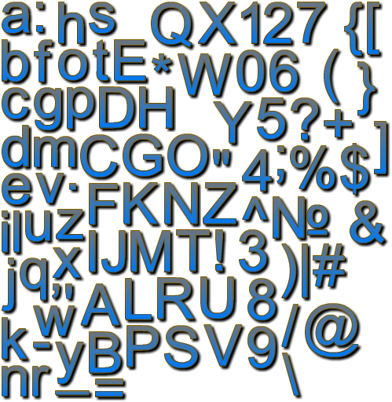
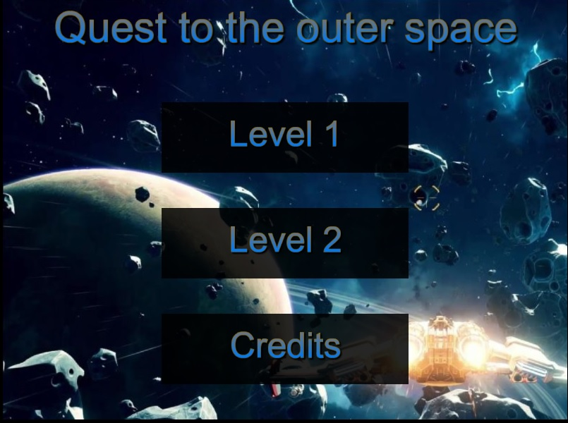
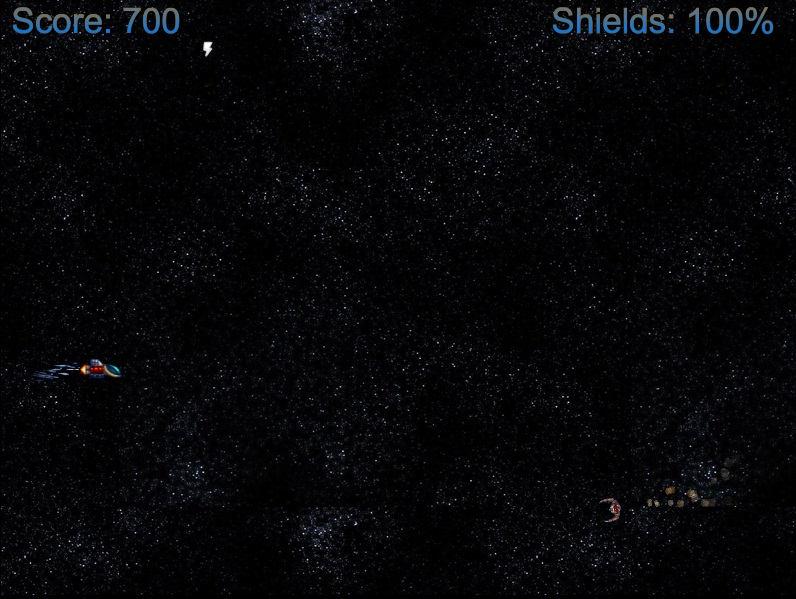
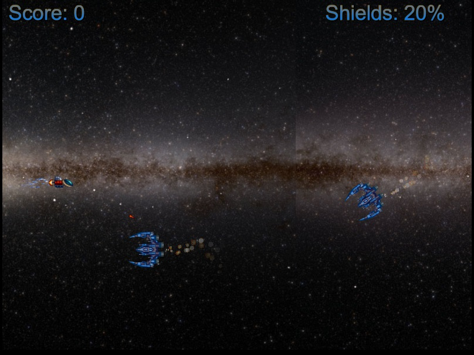
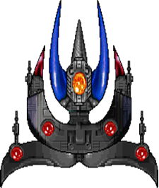

# ΙΟΝΙΟ ΠΑΝΕΠΙΣΤΗΜΙΟ, ΤΜΗΜΑ ΠΛΗΡΟΦΟΡΙΚΗΣ 

## ΜΑΘΗΜΑ
### Πολυμέσα  
Επιβλέπων καθηγητής: Χωριανόπουλος Κωνσταντίνος  

## Εργασία ανάπτυξης
### Shooter

## Στοιχεία φοιτητή  
### Παναγιωτης Νικος
### ΑΜ: Π2010059

### Εκτελέσιμο: [https://p10niko.github.io/Shooter/](https://p10niko.github.io/Shooter/)
### Αποθετήριο κώδικα: [https://github.com/p10niko/Shooter](https://github.com/p10niko/Shooter)

## Εισαγωγή  
Υλοποιήθηκαν όλα τα ερωτήματα και στα δύο παραδοτέα. Ίσως έχει κάποια bugs. Αυτό που με δυσκόλεψε ήταν τα boss στο τέλος κάθε level, και γι’ αυτό έγιναν όσο πιο απλά μπορούσα. Τον κώδικα τον έγραψα τοπικά στον υπολογιστή μου και προσπάθησα να κάνω commits όσο πιο ξεκάθαρα μπορούσα.

## Παραδοτέο 1
#### - [x] Initial settings (όπως περιγράφονται στο README.md του repository)
#### - [x] Link του παιχνιδιού στην αναφορά
#### - [x] Πρόσθεσε ήχους (shooting, explosions, κτλ.) και μουσική.
Προστέθηκαν ήχοι και μουσικοί για το κάθε level ξεχωριστά. Ξεχωριστό theme όταν εμφανίζεται το boss, καθώς και στο μενού και στα credits. Προστέθηκαν ήχοι στα όπλα του παίχτη ανάλογα με τις αναβαθμίσεις, ήχοι explosion, καθώς και ήχοι όταν ο παίχτης παίρνει κάποιο αντικείμενο. 

#### - [x] Πρόσθεσε την πρώτη κατηγορία εχθρών σύμφωνα με τα steps 12-17 από τις [οδηγίες](http://codeperfectionist.com/articles/phaser-js-tutorial-building-a-polished-space-shooter-game-part-3/). Για την συγκεκριμένη κατηγορία εχθρών χρησιμοποίησε την εικόνα enemy2.png αντί για την εικόνα green-enemy.png. Προσοχή: πρέπει να μελετήσετε τον κώδικα και να τον τροποποιήσετε κατάλληλα ώστε η συμπεριφορά των εχθρών να είναι ίδια αλλά να έρχονται από τα δεξιά προς τα αριστερά της οθόνης και όχι από πάνω προς τα κάτω όπως περιγράφετε στις οδηγίες.

#### - [x] Επέκτεινε το παιχνίδι ώστε να προσθέσεις ζωή και score ακολουθώντας τα steps 18-20 από τις [οδηγίες](http://codeperfectionist.com/articles/phaser-js-tutorial-building-a-polished-space-shooter-game-part-4/).

#### - [x] Ακολούθησε το step 21 από τις [οδηγίες](http://codeperfectionist.com/articles/phaser-js-tutorial-building-a-polished-space-shooter-game-part-4/). Προσοχή: πρέπει να δημιουργήσεις από [εδώ](http://kvazars.com/littera/) και να χρησιμοποιήσεις το δικό σου font.
Δημιούργησα το δικό μου font 

#### - [x] Πρόσθεσε τη δεύτερη κατηγορία εχθρών σύμφωνα με τα steps 22-24 από τις [οδηγίες](http://codeperfectionist.com/articles/phaser-js-tutorial-building-a-polished-space-shooter-game-part-4/). Για τη συγκεκριμένη κατηγορία εχθρών χρησιμοποίησε την εικόνα enemy3.png αντί για την εικόνα blue-enemy.png. Προσοχή: πρέπει να μελετήσετε τον κώδικα και να τον τροποποιήσετε κατάλληλα ώστε η συμπεριφορά των εχθρών να είναι ίδια αλλά να έρχονται από τα δεξιά προς τα αριστερά της οθόνης και όχι από πάνω προς τα κάτω όπως περιγράφετε στις οδηγίες.

### Παραδοτέο 2ο
#### - [x] Επεκτείνετε το παιχνίδι ώστε να αναβαθμίζονται τα όπλα του παίχτη σύμφωνα με τα steps 25-26 από τις [οδηγίες](http://codeperfectionist.com/articles/phaser-js-tutorial-building-a-polished-space-shooter-game-part-4/). Προσοχή: πρέπει να μελετήσετε τον κώδικα και να τον τροποποιήσετε κατάλληλα ώστε η αναβάθμιση να μην γίνεται σύμφωνα με το score αλλά όταν ο παίχτης συλλέγει κάποιο αντικείμενο που εμφανίζεται στην πίστα. Επίσης να υπάρχουν παραπάνω από δυο κατηγορίες αναβαθμίσεων. Επιπλέον [tutorial](http://phaser.io/tutorials/coding-tips-007).
Υπάρχουν 3 αναβαθμίσεις των όπλων του παίχτη, οι οποίες γίνονται όταν συλλέγει την αστραπή, η οποία εμφανίζεται σε τυχαίες χρονικές στιγμές στην πίστα. Η τελευταία αναβάθμιση είναι το laser beam το οποίο κρατάει για 5 δευτερόλεπτα, και μετά τα όπλα γυρνούν στην 2 αναβάθμιση. Σε κάθε αναβάθμιση ακούγετε ξεχωριστός ήχος.  

#### - [x] Προσθήκη Μenu στην αρχή για επιλογή πίστας και start of level. Δημιουργία τουλάχιστον δυο συνεχόμενων levels. Όταν ο πρωταγωνιστής ολοκληρώνει με επιτυχία το πρώτο level το παιχνίδι να συνεχίζει στο επόμενο. Το δεύτερο level θα πρέπει να είναι δυσκολότερο και να χρησιμοποιήσετε διαφορετικούς εχθρούς (new enemies, asteroids κτλ.). Μπορείτε να μελετήσετε τον κώδικα μιας περσινής εξαιρετικής [εργασίας](https://github.com/aMimikyu/Super-Mario) για να πάρετε μια ιδέα πως μπορείτε να υλοποιήσετε το συγκεκριμένο ζητούμενο.
Δημιούργησα το αρχικό μενού με δυο κουμπάκια level 1 , level 2 και ένα κουμπί για τα credits. Όταν ο παίχτης ολοκληρώνει με επιτυχία το level συνεχίζει αυτόματα στο επόμενο. Στο δεύτερο level χρησιμοποιήθηκαν διαφορετικοί εχθροί από το πρώτο, με την ίδια συμπεριφορά στην κίνηση. Αυτό που κάνει το level δυσκολότερο από το πρώτο, είναι ότι πυροβολούν και οι πρώτοι εχθροί, ενώ η δεύτερη κατηγορία εχθρών ρίχνει πλέον 2 σφαίρες αντί για μία. Προστέθηκαν επίσης μετεωρίτες οι οποίοι περνάνε τυχαία στην πίστα και κάνουν αρκετό damage στον παίχτη αν συγκρουστούν με αυτόν.

##### Menu

##### Level 1

##### Level 2

#### - [x] Προσθήκη ενός μεγάλου εχθρού στο τέλος του level. Μια ιδέα μπορείτε να πάρετε από [εδώ](http://codeperfectionist.com/articles/phaser-js-tutorial-building-a-polished-space-shooter-game-part-5/). Είστε ελεύθεροι να επιλέξετε την εικόνα και τη συμπεριφορά του μεγάλου εχθρού.

##### Level 1 boss

##### Level 2 boss

#### - [x] Τελική αναφορά την εργασίας που θα πρέπει απαραίτητα να περιλαμβάνει link του παιχνιδιού.

## Πηγές
Background themes https://opengameart.org/content/space-shooter-music

Sound effects https://opengameart.org/content/63-digital-sound-effects-lasers-phasers-space-etc

Explotion enemy  https://www.freesoundeffects.com/free-sounds/explosion-10070/

Laser beam sound https://freesound.org/people/peepholecircus/sounds/169991/

Items  https://opengameart.org/content/space-shooter-redux

menu background  https://www.wallpaperup.com/867525/EVERSPACE_space_shooter_futuristic_action_fighting_spaceship_1evers.html

level2 starfield https://i.redd.it/iqa7q0581ak11.jpg

level2 boss http://teamtask.blogspot.com/2011/10/boss-sprites.html

