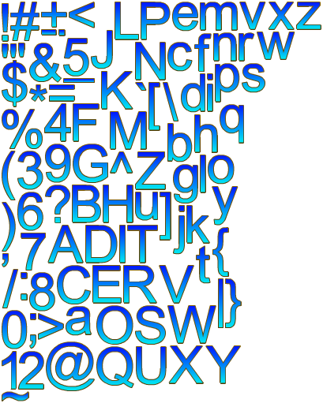
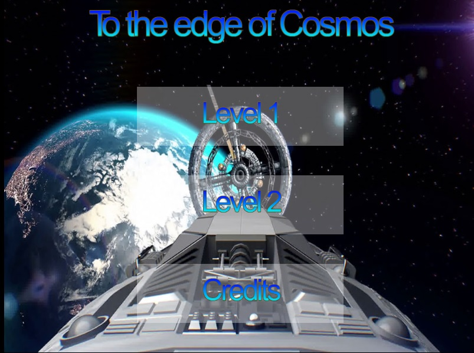
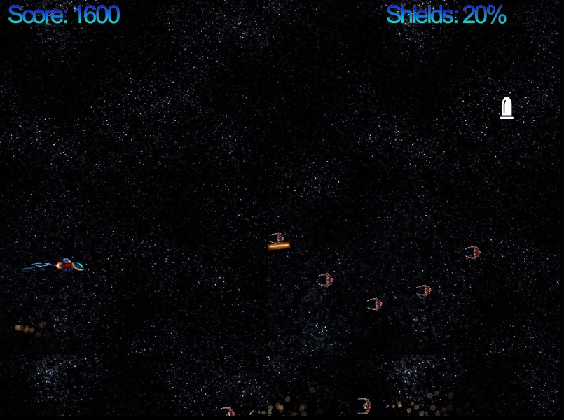
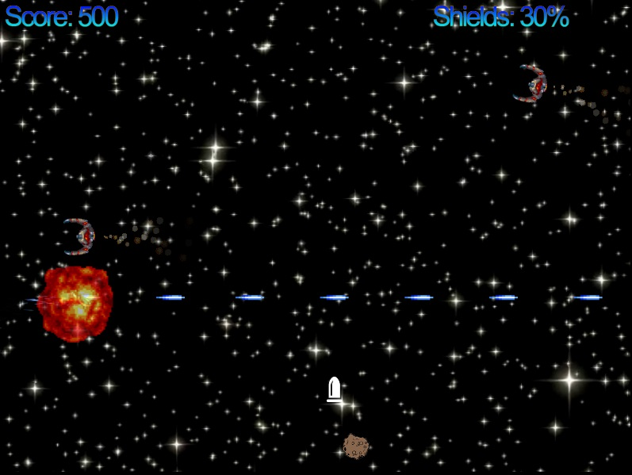
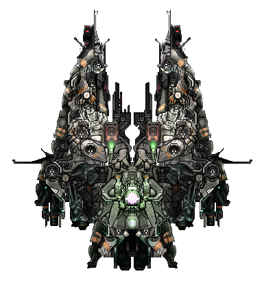

# ΙΟΝΙΟ ΠΑΝΕΠΙΣΤΗΜΙΟ, ΤΜΗΜΑ ΠΛΗΡΟΦΟΡΙΚΗΣ 

## ΜΑΘΗΜΑ
### Πολυμέσα  
Επιβλέπων καθηγητής: Χωριανόπουλος Κωνσταντίνος  

## Εργασία Περιεχομένου
### Προφίλ twitter: https://twitter.com/Nikosfarmakis4
### url ιστοσελίδας: https://p12farm.github.io/gr-live/
### Αποθετήριο κώδικα: https://github.com/p12farm/gr

## 1)
Έγιναν 10 αναρτήσεις στο twitter απο την ιστοσελίδα του βιβλίου σύμφωνα με τις οδηγίες της εργασίας.

## 2)
Η σελίδα έγινε φιλική προς τα social media. Συγκεκριμένα προστέθηκαν twitter και facebook εικονίδια στο footer ιστοσελίδας όπου οδηγούν στα αντίστοιχα προφίλ μου. Σε κάθε σελίδα άρθρου, είτε είναι φωτογραφία είτε μελέτη περίπτωσης κλπ, προστέθηκαν share buttons για twitter, facebook και linkedin. Είναι πολύ πιο εύκολο στον χρήστη να διαμοιράσει το περιεχόμενο στα κοινωνικά δίκτυα έτσι απο το να κάνει copy paste το url. Ένα άλλο πλεονέκτημα της συγκεκριμένης μεθόδου είναι ότι κάνοντας copy paste url που δεν είναι με λατινικούς χαρακτήρες (πχ ελληνικά) το url δημοσιεύεται url_encoded (μια σειρά απο χαρακτήρες που δεν διαβάζοντε και δεν είναι φιλικοί στον χρήστη).
Τέλος προστέθηκε νέα σελίδα στην ιστοσελίδα όπου υπάρχει twitter feed με τα tweets απο τον λογαριασμό μου στο twitter, τα οποία προστίθενται αυτόματα.

## Εργασία ανάπτυξης
### Shooter

## Στοιχεία φοιτητή  
### Νίκος Φαρμάκης
### ΑΜ: Π2012042

### Εκτελέσιμο: [https://p12farm.github.io/Shooter/](https://p12farm.github.io/Shooter/)
### Αποθετήριο κώδικα: [https://github.com/p12farm/Shooter](https://github.com/p12farm/Shooter)

## Εισαγωγή  
Έκανα όλες τις επεκτάσεις όπως περιγράφονται στις οδηγίες. Το παιχνίδι το επεξεργάστηκα τοπικά στον υπολογιστή μου με τη χρήση του visual studio code της Microsoft. Παρακολούθησα και διάβασα όλα τα παραδείγματα και έκανα τις απαραίτητες τροποποιήσεις.

## Παραδοτέο 1
#### - [x] Initial settings (όπως περιγράφονται στο README.md του repository)
#### - [x] Link του παιχνιδιού στην αναφορά
#### - [x] Πρόσθεσε ήχους (shooting, explosions, κτλ.) και μουσική.
Πρόσθεσα ήχους και μουσική. Το κάθε level έχει τη δική του μουσική, ενώ αυτή αλλάζει όταν στο παιχνίδι εμφανίζετε ο αρχηγός. Προστέθηκαν ήχοι shooting και εκρήξεων καθώς και διάφοροι άλλοι για να γίνει όσο πιο δυνατόν ελκυστικό το παιχνίδι. Τα mp3 βρίσκονται στον φάκελο assets/music/ 

#### - [x] Πρόσθεσε την πρώτη κατηγορία εχθρών σύμφωνα με τα steps 12-17 από τις [οδηγίες](http://codeperfectionist.com/articles/phaser-js-tutorial-building-a-polished-space-shooter-game-part-3/). Για την συγκεκριμένη κατηγορία εχθρών χρησιμοποίησε την εικόνα enemy2.png αντί για την εικόνα green-enemy.png. Προσοχή: πρέπει να μελετήσετε τον κώδικα και να τον τροποποιήσετε κατάλληλα ώστε η συμπεριφορά των εχθρών να είναι ίδια αλλά να έρχονται από τα δεξιά προς τα αριστερά της οθόνης και όχι από πάνω προς τα κάτω όπως περιγράφετε στις οδηγίες.
προστέθηκαν οι πρώτοι εχθροί και έγιναν οι κατάλληλες τροποποιήσεις ώστε να έρχοντε απο τα δεξιά προς τα αριστέρά και να έχουν την ίδια συμπεριφορά.

#### - [x] Επέκτεινε το παιχνίδι ώστε να προσθέσεις ζωή και score ακολουθώντας τα steps 18-20 από τις [οδηγίες](http://codeperfectionist.com/articles/phaser-js-tutorial-building-a-polished-space-shooter-game-part-4/).
Προστέθηκε ζωή και score. H ζωή (shields) μειώνετε όταν ο εχθρός ακουμπάει τον παίχτη και όταν η σφαίρα ακουμπάει τον παίχτη. Το καθένα έχει διαφορετικό damage.

#### - [x] Ακολούθησε το step 21 από τις [οδηγίες](http://codeperfectionist.com/articles/phaser-js-tutorial-building-a-polished-space-shooter-game-part-4/). Προσοχή: πρέπει να δημιουργήσεις από [εδώ](http://kvazars.com/littera/) και να χρησιμοποιήσεις το δικό σου font.
Δημιουργήθηκε font (spacefont.fnt και spacefont.png) και βρίσκετε στον φάκελο /assets/spacefont/ 

#### - [x] Πρόσθεσε τη δεύτερη κατηγορία εχθρών σύμφωνα με τα steps 22-24 από τις [οδηγίες](http://codeperfectionist.com/articles/phaser-js-tutorial-building-a-polished-space-shooter-game-part-4/). Για τη συγκεκριμένη κατηγορία εχθρών χρησιμοποίησε την εικόνα enemy3.png αντί για την εικόνα blue-enemy.png. Προσοχή: πρέπει να μελετήσετε τον κώδικα και να τον τροποποιήσετε κατάλληλα ώστε η συμπεριφορά των εχθρών να είναι ίδια αλλά να έρχονται από τα δεξιά προς τα αριστερά της οθόνης και όχι από πάνω προς τα κάτω όπως περιγράφετε στις οδηγίες.
Προστέθηκε η δεύτερη κατηγορία εχθρών και έγιναν οι απαραίτητες διορθώσεις ώστε να έρχονται από τα δεξιά χωρία να επηρεαστεί η συμπεριφορά τους.

### Παραδοτέο 2ο
#### - [x] Επεκτείνετε το παιχνίδι ώστε να αναβαθμίζονται τα όπλα του παίχτη σύμφωνα με τα steps 25-26 από τις [οδηγίες](http://codeperfectionist.com/articles/phaser-js-tutorial-building-a-polished-space-shooter-game-part-4/). Προσοχή: πρέπει να μελετήσετε τον κώδικα και να τον τροποποιήσετε κατάλληλα ώστε η αναβάθμιση να μην γίνεται σύμφωνα με το score αλλά όταν ο παίχτης συλλέγει κάποιο αντικείμενο που εμφανίζεται στην πίστα. Επίσης να υπάρχουν παραπάνω από δυο κατηγορίες αναβαθμίσεων. Επιπλέον [tutorial](http://phaser.io/tutorials/coding-tips-007).
Προστέθηκαν 2 αναβαθμίσεις στα όπλα του παίχτη. Η τριπλή βολή και το laser beam το οποίο διαρκεί 5 δευτερόλεπτα ενώ μετά τα όπλα γυρνάνε στην προηγούμενη αναβάθμιση.  Η αναβάθμιση γίνετε όταν ο παίχτης παίρνει τη λευκή σφαίρα που εμφανίζετε στο παιχνίδι. Η εμφάνιση της σφαίρας καθορίζετε από  ένα εύρος προκαθορισμένων αριθμών που και επιλέγετε τυχαία ένας που καθορίζει το interval της επόμενης εμφάνισης της σφαίρας. Υπάρχει ένα πρόβλημα εδώ καθώς ο χρόνος μετράει από το αρχικό menu και όχι από την αρχή του level, επίσης μετράει και όταν το παιχνίδι βρίσκετε σε παύση. Το πρόβλημα είναι ότι ο κώδικας είναι στο index.html και όχι στο level1.js και level2.js. H δομή των αρχείων σε αυτό το σημείο δεν μου επέτρεπε να διορθώσω το πρόβλημα.  

#### - [x] Προσθήκη Μenu στην αρχή για επιλογή πίστας και start of level. Δημιουργία τουλάχιστον δυο συνεχόμενων levels. Όταν ο πρωταγωνιστής ολοκληρώνει με επιτυχία το πρώτο level το παιχνίδι να συνεχίζει στο επόμενο. Το δεύτερο level θα πρέπει να είναι δυσκολότερο και να χρησιμοποιήσετε διαφορετικούς εχθρούς (new enemies, asteroids κτλ.). Μπορείτε να μελετήσετε τον κώδικα μιας περσινής εξαιρετικής [εργασίας](https://github.com/aMimikyu/Super-Mario) για να πάρετε μια ιδέα πως μπορείτε να υλοποιήσετε το συγκεκριμένο ζητούμενο.
Δημιουργήθηκε αρχικό menu με τον τίτλο του παιχνιδιού «To the edge of cosmos» και τρία κουμπάκια, ένα για κάθε level και ένα για τα credits. Δημιουργήθηκαν δύο διαδοχικά level. Το δεύτερο level έχει διαφορετικό background από το πρώτο και είναι πιο δύσκολο. Οι εχθροί είναι περισσότεροι, οι πρώτοι εχθροί είναι μεγαλύτεροι και ποδοβολάνε και αυτοί μόλις βρεθούν στο κέντρο της οθόνης και υπάρχουν μετεωρίτες που κάνουν 40 damage στον παίχτη. Επίσης υπάρχει ένα extra αντικείμενο βοήθειας για τον παίχτη, η ασπίδα που δίνει +40 ζωή. Η λογική εμφάνισης της ασπίδας και του μετεωρίτη είναι ίδια με την σφαίρα που αναβαθμίζει τα όπλα, οπότε υπάρχει το ίδιο πρόβλημα (μικρής σημασίας). Επίσης δημιουργήθηκε credits scene που παίζει αυτόματα μετά το τέλος του δεύτερου level και με το που τελειώσει εμφανίζετε πάλι το αρχικό menu.  Η εργασία που υποδείχτηκε για την υλοποίηση του συγκεκριμένου ερωτήματος με βοήθησε αρκετά.

##### Menu

##### Level 1

##### Level 2

#### - [x] Προσθήκη ενός μεγάλου εχθρού στο τέλος του level. Μια ιδέα μπορείτε να πάρετε από [εδώ](http://codeperfectionist.com/articles/phaser-js-tutorial-building-a-polished-space-shooter-game-part-5/). Είστε ελεύθεροι να επιλέξετε την εικόνα και τη συμπεριφορά του μεγάλου εχθρού.
Χρησιμοποιήθηκαν διαφορετικές εικόνες αρχηγών για τα δύο level. Στο πρώτο level ο αρχηγός εμφανίζετε στο 10000 score και στο δεύτερο στ0 15000. Η διαφορά τους είναι στο damage που κάνουν οι σφαίρες στον παίχτη. Οι σφαίρες που ρίχνει είναι πολλές και στο πρώτο level κάθε μία έχει damage 2, ενώ στο δεύτερο 5.

##### Level 1 boss

##### Level 2 boss

#### - [x] Τελική αναφορά την εργασίας που θα πρέπει απαραίτητα να περιλαμβάνει link του παιχνιδιού.

## Πηγές
Η μουσική επένδυση των level, του menu και των credits κατεβάστηκε από https://opengameart.org/content/free-music-pack

Τα sound effects καταβάστηκαν απο https://opengameart.org/content/space-shooter-sound-effects

Ο αρχηγός του δεύτερου level από http://yoneylyn.blogspot.com/2015/03/blog-post_2.html
