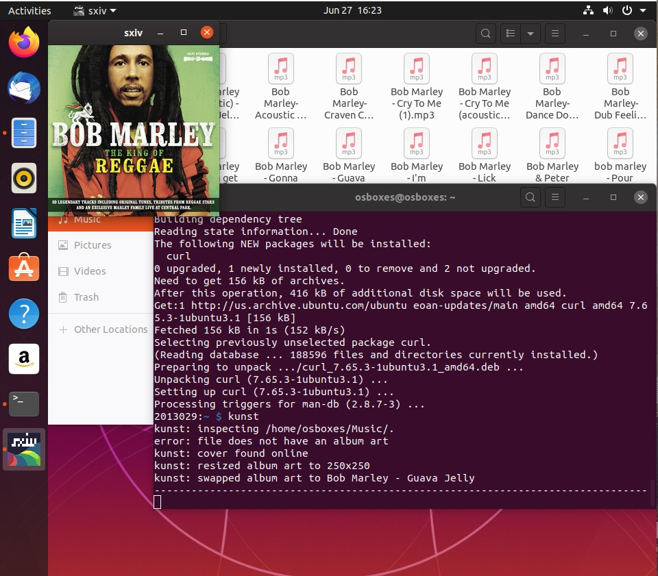

# ΙΟΝΙΟ ΠΑΝΕΠΙΣΤΗΜΙΟ, ΤΜΗΜΑ ΠΛΗΡΟΦΟΡΙΚΗΣ 
## ΜΑΘΗΜΑ
### Πολυμέσα  
Επιβλέπων καθηγητής: Χωριανόπουλος Κωνσταντίνος 

## Στοιχεία φοιτήτριας  
### Μαρία Δήμα
### ΑΜ: Π2013029

## Εισαγωγή
Χρησιμοποίησα το περιβάλλον wsl2 των windows 10 με ubuntu 18.04 LTS για να κάνω συνολίκά 4 ασκήσεις και το virtual box με ubuntu 19.10 για να κάνω τις επιπλέον 2. Η αναφορά περιέχει code blocks σε κάθε άσκηση url με το recorded session στο λογαριασμό μου στο asciinema, καθώς και πηγές άντλησης πληροφοριών. Υλοποίησα επιπλέον 4 παραδοτέα του συμμετοχικού και εκπαιδευτικού υλικού.

## Συμμετοχικό εκπαιδευτικό υλικό
#### Αποθετήριο σελίδας βιβλίου https://github.com/p13dima/gr
#### url σελίδας βιβλίου https://p13dima-gr.netlify.app/
#### twitter account https://twitter.com/Mary59956920
#### Codepen profile https://codepen.io/p13dima

### Παραδοτέο 2.Α
Έγιναν 10 tweets απο τη σελίδα του βιβλίου.

##### 1. https://twitter.com/Mary59956920/status/1277180500411637761
##### 2. https://twitter.com/Mary59956920/status/1277181100314578945
##### 3. https://twitter.com/Mary59956920/status/1277181883059757058
##### 4. https://twitter.com/Mary59956920/status/1277182615569735680
##### 5. https://twitter.com/Mary59956920/status/1277183090033639425
##### 6. https://twitter.com/Mary59956920/status/1277183446511685632
##### 7. https://twitter.com/Mary59956920/status/1277183701147885568
##### 8. https://twitter.com/Mary59956920/status/1277184282512015360
##### 9. https://twitter.com/Mary59956920/status/1277184807794020352
##### 10. https://twitter.com/Mary59956920/status/1277185559224635392

### Παραδοτέο 2.B
Έκανα αλλαγές στη σελίδα ώστε το περιεχόμενο της να είναι περισσότερο συμβατό με τα κοινωνικά δίκτυα. Πρόσθεσα τη δυνατότατα share μέσω κουμπιών στα posts καθώς και νέο κουμπί στο κεντικό menu της σελίδας με ένα twitter feed με τα tweets μου 

##### twitter stream https://p13dima-gr.netlify.app/twitter-feed/

### Επιπλέον παραδοτέο 1.Γ.2
##### Bιογραφία Don Norman https://p13dima-gr.netlify.app/biography/don-norman/

###### Πηγές
https://en.wikipedia.org/wiki/Don_Norman

https://en.wikipedia.org/wiki/The_Design_of_Everyday_Things

### Επιπλέον παραδοτέο 1.Β
##### Διαδραστικό παραδειγμα: Scroll top https://p13dima-gr.netlify.app/remix/scroll-top/

###### Πηγές
https://www.lipsum.com/feed/html

https://stackoverflow.com/questions/48482870/making-a-button-appear-on-scroll-with-javascript-jquery

## Άσκηση 1. Search, download and play (with the terminal) your favorite song of the month from youtube.
#### asciinema https://asciinema.org/a/QDPfqsqwPdNcsvp21O3DkJXTd
Χρησιμοποιήθηκε το youtube-dl
```
sudo apt-get install youtube-dl
```

Επέλεξα να κατεβάσω το fix you απο Coldplay https://www.youtube.com/watch?v=k4V3Mo61fJM 

```
youtube-dl -x --audio-format mp3 -o fixyou.mp3 ytsearch$1:"$Coldplay - Fix You"
```

Για την αναπαραγωγή χρησιμοποίησα τον mpv player

```
sudo apt-get install mpv
mpv fixyou.mp3
```

#### Πηγές άσκησης
https://askubuntu.com/questions/178481/how-to-download-an-mp3-track-from-a-youtube-video

https://askubuntu.com/questions/643286/can-i-download-videos-from-a-youtube-search-query-using-youtube-dl

https://askubuntu.com/questions/630134/how-to-specify-a-filename-while-extracting-audio-using-youtube-dl

## Άσκηση 2. Manage your music library. Import your music library, add tags and delete/add songs.
#### asciinema https://asciinema.org/a/y9ThdSWKMS1JWtkWHsHuLZRIT
Εκκατέστησα το beets

```
sudo apt-get install beets
```
Στη συνέχεια προσθεσα στο config.yaml του beets τα path για την αποθήκευση των κομματιών και της βιβλιοθήκης.

```
sudo nano .config/beets/config.yaml
```

```
directory: ~/beets_music
library: ~/beets_library/library.blb
import:
    move: no
    copy: yes
```
Δημιούργησα τα δύο νέα directories για να λειτουργήσει το beets. 

```
sudo mkdir beets_music
sudo mkdir beets_library
```

Επειδή το beets δεν είχε πρόσβαση στα directories αυτά άλλαξα τα permitions.

```
sudo chmod -R 777 beets_music
sudo chmod -R 777 beets_library
```

Για να προσθέσω κομμάτια είχα δημιουργήσει 2 directories music1 και music2 με διαφορα τραγούδια.

```
beet import music1
beet import music2
```

modify (add edit tags)

```
beet modify <artist or other tag> <tag>="new tag"
```

delete

```
beet remove title:'song title'
```

Για να δεί κανεις κομμάτια με συγκεκριμένες λέξεις κλειδιά πχ tags

```
beet ls <tag or artist or anything>
```

### Πηγές άσκησης
https://www.youtube.com/watch?v=-eVTV3npXZQ

https://beets.readthedocs.io/en/v1.3.17/reference/query.html


## Άσκηση 3. Manage torrent files. Search and download a torrent.
#### asciinema https://asciinema.org/a/c3WFsJAatANVYD3Zuw6KUFZZL
Για την άσκηση αυτή χρησιμοποίησα δύο εργαλεία. Για την αναζήτηση του torrent χρησιμοποίσησα το we-get, και για να κατεβάσω το torrent χρησιμοποίησα το deluge. Η εγκατάσταση του we-get εγινε μέσω pip.

```
sudo pip3 install git+https://github.com/rachmadaniHaryono/we-get
```

Αμέσως μετά εγκατέστησα το deluge.

```
sudo apt-get install deluge deluged deluge-console
```

Επέλεξα να κατεβάσω το Lubuntu linux οπότε με τη βοήθεια του we-get έψαξα για το Lubuntu στο pirate bay

```
we-get --search "Lubuntu" --target the_pirate_bay
```

Στη συνέχεια για να δώ το magnet link απο τα αποτελέσματα αναζήτησης...

```
show lubuntu-16.10-desktop-i386.iso
```

Τέλος κλείνοντας το we-get άνοιξα το console to deluge, και προσθεσα το magnet link

```
deluge-console
add -p /home/maria/downloads <magnet link>
```

### Πηγές άσκησης
https://www.ostechnix.com/search-torrents-command-line-linux/

https://askubuntu.com/questions/315113/how-to-run-deluge-from-cli


## Άσκηση 4. Batch image conversion. Convert your image files to different sizes and formats
#### asciinema https://asciinema.org/a/2hSTASx15pGnOMpgLSNdxOx6F
Αρχικά δημιουργησα directory images, όπου έβαλα 4 images που κατέβασα απο https://www.stockvault.net/c/nature/landscape.
Τις εικόνες της πέρασα απο τον explorer των windows κάνωντας browse το filesystem μου με την εντολή.

```
exploer.exe .
```
Εγκατέστησα το imagemagick.

```
sudo apt-get install imagemagick
```

Δημιουργησα directory μεσα στο images με ονομασία resized, και είδα τις εικόνες με το μέγεθός τους

```
cd images
mkdir resized
ls -lh
```
Στη συνέχεια έτρεξα το conversion του imagmagick με την εντολή mogrify. Μείωσα το μέγεθος αρχείου όλων των εικόνων και τις μετέτρεψα σε .png απο .jpg

```
mogrify -path resized -adaptive-resize 50% -quality 60% -format png *
```

Πάλι επιβεβαίωσα τις αλλαγες

```
cd resized
ls -lh
```

### Πηγές άσκησης
https://www.youtube.com/watch?v=-hPleOyZJr4

https://www.imagemagick.org/discourse-server/viewtopic.php?t=21454

http://www.imagemagick.org/Usage/basics/#mogrify

## Επιπλέον άσκηση 5. Visualize an mp3. Demonstrate album art and visualizations with an mp3 player and various songs.
#### asciinema https://asciinema.org/a/O6ud9pUClU4a9rNp2tFnM8owe
Εγκατέστησα το mpd και το ncmpcpp. Στη συνέχεια επεξεργαστηκα να connfig files και των 2 ώστε να ορίσω τα paths προς το Music dir μου και να ενεργοποιήσω και το virtualisation του ncmpcpp.

```
sudo apt-get install mpd ncmpcpp
sudo nano /etc/mpd.conf
sudo nano .ncmpcpp/config
```

Στο config file του mpd πρόσθεσα

```
audio_output {                                                                  
        type            "fifo"                                                  
        name            "fifo_mpd"                                              
        path            "/tmp/mpd.fifo"                                         
        format          "44100:16:2"                                            
} 
```

και στο config file του ncmpcpp
```
# visualizer
visualizer_fifo_path = "/tmp/mpd.fifo"
visualizer_output_name = "my_fifo"
visualizer_sync_interval = "12"
#visualizer_type = "wave" (spectrum/wave)
visualizer_type = "spectrum" (spectrum/wave)
visualizer_in_stereo = "yes"
visualizer_look = "+|"
```

στη συνέχεια εγκατέστησα το kunst με τις απαραίτητε επεκτάσεις

```
sudo apt-get isntall sxiv
sudo apt-get isntall ffmpeg
sudo apt-get isntall mpc
sudo apt-get isntall jq
sudo apt-get install curl
git clone https://github.com/sdushantha/kunst
cd kunst
sudo make install
```

Ετρεξα το ncmpcpp και έκανα update την database με το πλήκτρο u, έκανα επιλογή κομματιού και είδα το visualisation στο visualisation tab του ncmpcpp πατώντας το 8
στη συνέχεια έτρεξα το kunst όπου μου κατέβασε αυτόματα το cover του album.

```
ncmpcpp
kunst
```



### Πηγές άσκησης
https://github.com/sdushantha/kunst

https://computingforgeeks.com/how-to-configure-mpd-and-ncmpcpp-on-linux/

## Επιπλέον άσκηση 6. Create your final presentation, three slides with your name-AM-github, checkbox list of deliverables done, and highlights of significant contributions and/or roadblocks
#### asciinema https://asciinema.org/a/tJm5FhCjQ26jS31Y3AgIu7yWe
Εγκατέστησα το mdp αφου πρώτα έκανα εγκατάσταση της βιβλιοθήκης ncurses

```
sudo apt-get install libncurses5-dev libncursesw5-dev
git clone https://github.com/visit1985/mdp.git
cd mdp
make
make install
mdp sample.md
```

Δγμιουργησα νέο αρχείο final-presentation.md με την παρουσίασή μου.

```
mdp final-presentation.md
```

### Πηγές άσκησης
https://github.com/visit1985/mdp

https://www.cyberciti.biz/faq/linux-install-ncurses-library-headers-on-debian-ubuntu-centos-fedora/

## Συμπεράσματα
Μέσα απο την υλοποίηση των 6 παραπάνω ασκήσεων έμαθα να χρησιμοποιώ τα σχετικά εργαλεία του terminal. Έμαθα να κανω search στο youtube και να κατεβάζω τραγούδια σε μορφή mp3, να κάνω αναζήτηση torrent και να το κατεβάζω, να μετατρέπω αρχεία εικόνων και να οργανώνω τη μουσική μου. Εξοικειώθηκα περισσότερο στο λειτουργικό linux και ιδιαίτερα στο command line και στη χρήση (εγκατάσταση και παραμετροποίηση διάφορων εργαλείων).


