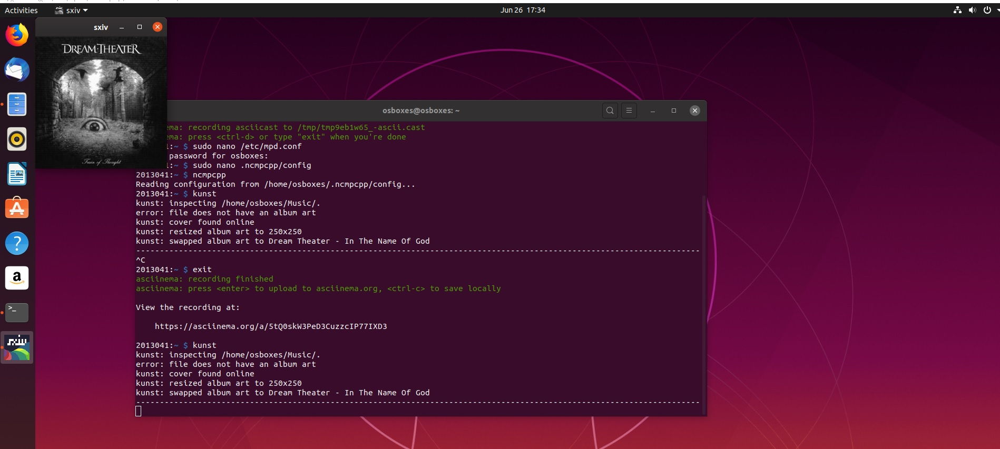

# ΙΟΝΙΟ ΠΑΝΕΠΙΣΤΗΜΙΟ, ΤΜΗΜΑ ΠΛΗΡΟΦΟΡΙΚΗΣ 
## ΜΑΘΗΜΑ
### Πολυμέσα  
Επιβλέπων καθηγητής: Χωριανόπουλος Κωνσταντίνος 

## Στοιχεία φοιτητή  
### Φοίβος Αργυρίδης
### ΑΜ: Π2013041

## Εισαγωγή
Υλοποίησα συνολικά 6 ασκήσεις, οι οποίες έγιναν σε περιβάλλον linux με τη βοήθεια του terminal. Δούλεψα σε windows 10 με wsl (ubuntu), αλλα και σε virtual box με Ubuntu 19.01. Όλα τα recorded sessions είναι στον προσωπικό μου λογαριασμό asciinema και τα link βρίσκονται παρακάτω στην ανάλυση της κάθε εργασίας, καθώς επίσης και url απο σελίδες ή βίντεο που άντλησα πλήροφορίες για την υλοποίησή τους. Υλοιποιήθηκαν επίσης και 4 παραδοτέα συμμετοχικού εκπαιδευτικού υλικού. Έγινα 10 tweets απο τη σελίδα του βιβλίου στον προσωπικό μου λογαριασμό στο twitter, Εκανα αλλαγές στη σελίδα του βιβλίου ώστε να είναι φιλική προς τα social media και πρόσθεσα επιπλέον ένα νέο διαδραστικό παραδειγμα και μία μελέτη περίπτωσης.

## Συμμετοχικό περιεχόμενο
#### Αποθετήριο https://github.com/fivosf/gr
#### Σελίδα βιβλίου https://fivos-gr.netlify.app/

### Παραδοτέο 2.Α
#### twitter account https://twitter.com/fivosarg
#### twitter posts
##### 1) https://twitter.com/fivosarg/status/1259598879579934721
##### 2) https://twitter.com/fivosarg/status/1259599791530614787
##### 3) https://twitter.com/fivosarg/status/1259601399131840513
##### 4) https://twitter.com/fivosarg/status/1259602704642576385
##### 5) https://twitter.com/fivosarg/status/1259603435881627650
##### 6) https://twitter.com/fivosarg/status/1259604970464296964
##### 7) https://twitter.com/fivosarg/status/1259605848965472258
##### 8) https://twitter.com/fivosarg/status/1259606061239152640
##### 9) https://twitter.com/fivosarg/status/1259607448748527620
##### 10) https://twitter.com/fivosarg/status/1259607973749547009

## Παραδοτέο 2.Β
Τροποποίησα την σελίδα ώστε να είναι φιλική ως προς τα social media. Συγκεκριμένα στο footer πρόσθεσα εικονίδια με url προς τους προσωπικους μου λογαριασμούς twitter, facebook και github. Σε κάθε post πρόσθεσα τη δυνατότητα share στο facebook, twitter και linkedin και χρήστης μπορεί πλέον να δημοσιεύσει με το πάτημα ενός κουμπιού το post στο κοινωνικό δίκτυο που επιθυμεί απο τα παραπάνω. Επίσης όρισα την εικόνα του κεντρικού header ως og:image καθώς σε πολλές σελίδες δεν υπάρχει εικόνα να για να οριστεί στα social media και το header απουσιάζει. Τέλος πρόσθεσα ένα twitter feed απο τον λογαριασμό μου στο twitter σε ξεχωριστή σελίδα που υπάρχει και στο κεντρικό μενού. Για την δημιουργία του twitter feed χρησιμοποίησα το ίδιο το twitter https://publish.twitter.com/?buttonType=FollowButton&query=https%3A%2F%2Ftwitter.com%2Ffivosarg&widget=Timeline.
Οι αλλαγές ήταν εύκολο να γίνουν απο τις ρυθμίσεις του θέματος _config.yml

##### twitter feed https://fivos-gr.netlify.app/twitter/

### Επιπλέον παραδοτέο 1.Γ.1
Νέα μελέτη περίπτωσης
#### Google assistant https://fivos-gr.netlify.app/case-study/google-assistant/

##### Πηγή 
https://en.wikipedia.org/wiki/Google_Assistant

### Επιπλέον παραδοτέο 1.Β
Νέο διαδραστικό παράδειγμα
#### Input form https://fivos-gr.netlify.app/remix/input-form/

##### Πηγή
https://www.w3schools.com/css/tryit.asp?filename=trycss_forms


## Άσκηση 1. Search, download and play (with the terminal) your favorite song of the month from youtube.
#### asciinema: https://asciinema.org/a/eDpKh5BJxEvNRrBhJVsPhc4IR
Εγκατέστησα το youtube-dl

```
sudo apt-get install youtube-dl
```

Δημιούργησα directory music

```
mkdir music
```

Εψαξα και κατέβασα σε μορφή mp3 το nothing else matters των metallica με τη χρήση του youtube-dl στο music directory που δημιούργησα

```
youtube-dl -x --audio-format mp3 -o music/nothin_else_matters.mp3 ytsearch$1:"Metallica: Nothing Else Matters"
```

Έκανα αναπαραγωγή του τραγουδιού με τον mpv player

```
cd music
mpv nothin_else_matters.mp3
```

## Πηγές

https://www.youtube.com/watch?v=9A-HLSvtBWc

https://askubuntu.com/questions/178481/how-to-download-an-mp3-track-from-a-youtube-video

https://askubuntu.com/questions/630134/how-to-specify-a-filename-while-extracting-audio-using-youtube-dl

https://askubuntu.com/questions/643286/can-i-download-videos-from-a-youtube-search-query-using-youtube-dl


## Άσκηση 2. Manage torrent files. Search and download a torrent.
#### asciinema: https://asciinema.org/a/BFOukKNf4sCsHCYmr0CaAOnMs
Χρησιμοποίησα το we-get γαι να κανω αναζήτηση του torrent, και το rtorrent για να κατεβάσω το magnet.
Η εγκατάσταση του we-get γινετε μέσω pip και απαιτεί python > 3.5.

```
sudo pip3 install git+https://github.com/rachmadaniHaryono/we-get
sudo apt-get install rtorrent
```

Η αναζήτηση με το we-get γινετε με την εντολή:

```
we-get --search "Thunderstruck" --target  the_pirate_bay
show <επιλογή όνομα torrent>
```

ξεκινάμε τον rtorrent

```
rtorrent

backspace
paste magnet
```

## Πηγές
https://www.ostechnix.com/search-torrents-command-line-linux/

https://www.linuxtechi.com/rtorrent-command-line-bittorrent-client-ubuntu-linux/


## Άσκηση 3. Manage your music library. Import your music library, add tags and delete/add songs.
#### asciinema: https://asciinema.org/a/XXaSLzm2FOiE8rKUDkzYYjbDt

Εγκατέστησα το beets

```
sudo apt-get install beets
```

επεξεργαστηκα το configuration file του για να ορισω τα path

Δημιουργησα directories για το beets

```
mkdir beets_m
mkdir beets_l
```

```
beet config -p
sudo nano /home/fivos/.config/beets/config.yaml

directory: ~/beets_m
library: ~/beets_l/library.blb
import:
   move: yes
   copy: no
```

Πρόσθεσα μουσική, tags και έσβησα απο τη λιστα του beets.
```
beet import music/mymusic
beet ls
beet modify <you can modify as you want here>
beet remove title:'you song title'
```

## Πηγές
https://beets.readthedocs.io/en/v1.3.17/reference/query.html


## Άσκηση 4. Batch image conversion. Convert your image files to different sizes and formats.
#### asciinema: https://asciinema.org/a/nYxoD4BmPgbOKcESSYv0lzcha
Για την άσκηση αυτή δημιουργησα directory askisi4 και προσθεσα εικόνες που είχα στον υπολογιστή μου. Εγκατέστησα το imagemagick.

```
sudo apt-get install imagemagick
```

Δηιούργησα νέο directory για να αποθηκεύσω τις επεξεργασμένες εικόνες.

```
mkdir new_images
```

χρησιμοποιόντας την εντολή mogrify του imagemagick μείωσα το μέγεθος των εικόνων και τις μετέτρεψα σε png απο jpg.
Πετάει κάποιο error, αλλα τρέχει κανονικά.

```
mogrify -path new_images -adaptive-resize 40% -quality 50% -format png *
```

Οι αλλαγές επιβεβαιώνονται και στα δύο directories με την εντολή

```
ls -lh
```

## Πηγές
https://imagemagick.org/script/mogrify.php

## Επιπλέον άσκηση 5. Visualize an mp3. Demonstrate album art and visualizations with an mp3 player and various songs.
#### asciinema: https://asciinema.org/a/5tQ0skW3PeD3CuzzcIP77IXD3
Εγκατέστησα το mpd και το ncmpcpp. Το ncmpcpp παρέχει visualisations και μπόρεσα να βρω αρκετές πληροφορίες για το πως να το ενεργοποιήσω.

```
sudo apt-get install mpd ncmpcpp
```

Εγκατέστησα το kunst και όλα τα dependancies που χρειαζόταν για να λειτουργήσει.

```
git clone https://github.com/sdushantha/kunst
cd kunst
sudo make install
```
Στη συνέχεια επεξεργάστηκα τα config files του mpd και του ncmpcpp ωστε να ορίσω τα απαραίτητα paths και να ενεργοποιήσω το visualisation.

```
sudo nano /etc/mpd.conf
sudo nano .ncmpcpp/config
```

στη συνέχεια έτρεξα το ncmpcpp για να κάνω αναπαραγωγή και να δείξω το visualisation και μετα το kunst για να εμφανίσω το album

```
ncmpcpp
kunst
```



### Πηγές
https://linuxconfig.org/configuring-the-mpd-music-server-on-ubuntu-linux

https://github.com/sdushantha/kunst

http://www.chrisreynolds.org.uk/linux-tips/set-up-ncmpcpp---music-player---with-visualizer-in-ubuntu

## Επιπλέον άσκηση 6. Create your final presentation, three slides with your name-AM-github, checkbox list of deliverables done, and highlights of significant contributions and/or roadblocks.
#### asciinema: https://asciinema.org/a/JRKTaOSKv2pGQWcWsy6VGydoB
Εγκατέστησα το mdp και τις απαραίτητες επεκτάσεις

```
sudo apt-get install libncurses5-dev libncursesw5-dev
git clone https://github.com/visit1985/mdp.git
cd mdp
make
sudo make install
```
μέσα στο directory mdp υπάρχει αρχείο sample.md που έχει όλες τις  πληροφορίες για να δημιουργήει κάποιος τη δική του παρουσίαση. Δημιουργησα αρχείο presentation.md με την παρουσίασή μου.

```
mdp presentation.md
```

### Πηγές
https://github.com/visit1985/mdp

## Συμπεράσματα
Με την υλοποίηση των παραπάνω ασκήσεων έμαθα να χρησιμοποιώ σημαντικά εργαλεία του linux terminal. Η δουλειά γίνετε γρηγορότερα πχ στην επεξεργασία εικόνων με το imagemagick αν το συγκρίνω με το photoshop. To γραφικό περιβάλλον έχει το συν ότι βλέπεις τι κάνεις (δεν χεριάζετε πάντα) αλλά τρώει αρκετή ram. Έτσι αν θέλεις κάτι γρήγορο μπορείς να χρησιμοποιήσεις τα εργαλεία του command line, τα οποία πολλές φορές μπορείς να τα επεκτείνεις και να τα κάνεις καλύτερα ώστε να σου δίνουν καλύτερο outout με το τι συμβαίνει. Μέσα απ’ όλη τη διαδικασία έμαθα αρκετές εντολές του linux terminal τις οποίες σκοπεύω να χρησιμοποιώ από δω και πέρα.
