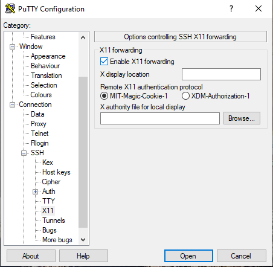
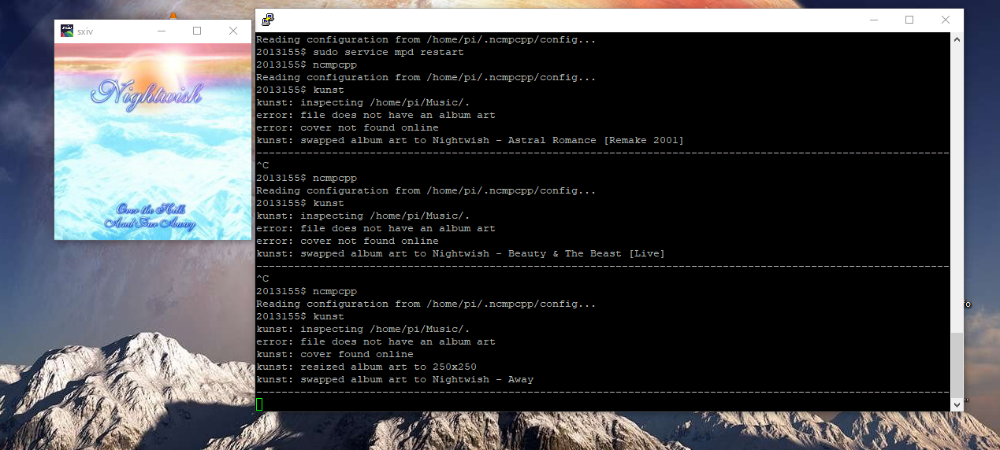

# ΙΟΝΙΟ ΠΑΝΕΠΙΣΤΗΜΙΟ, ΤΜΗΜΑ ΠΛΗΡΟΦΟΡΙΚΗΣ 
## ΜΑΘΗΜΑ
### Πολυμέσα  
Επιβλέπων καθηγητής: Χωριανόπουλος Κωνσταντίνος 

## Στοιχεία φοιτητή  
### Νίκος ξαντινίδης
### ΑΜ: Π2013155

## Eργασία 1 search, download and play (with the terminal) your favorite song of the month from youtube

#### url asciinema to recorded terminal session: https://asciinema.org/a/l8QPkOrJE5PDd5FDg8RZAjfr4
Για τη συγκεκριμένη εργασία χρησιμοποιήθηκε το youtube-dl απο το οποίο μπορείς να κάνεις οποιαδήποτε αναζήτηση στο youtube και να κατεβάσεις το βίντεο ή μόνο τον ήχο σε οποιαδήποτε μορφή. Επέλεξα να κατεβάσω το the show must go on απο Queen.

```
youtube-dl -x --audio-format mp3 -o choosename.mp3 ytsearch$1:"$search term
```

Διαλέγουμε δηλαδή μόνο τον ήχο ως mp3, επιλέγουμε να όνομα για να αποθηκεύσουμε το αρχείο, στο $1 λέμε οτι θέλουμε να κατεβάσουμε μόνο ένα αποτέλεσμα απο το search και στη συνέχεια γράφουμε τον όρο αναζήτησης. Το αρχείο κατεβαίνει στο directory που βρισκόμαστε.

Για την αναπαραγωγή του αρχείου mp3, χρησιμοποίησα τον mplayer αντί για το mpv.Η εγκατάσταση του mplayer σε debian γίνετε με την παρακάτω εντολή.

```
sudo apt-get install mplayer
```
και η αναπαραγωγή

```
mplayer /path/to/file.mp3
```

Στην περίπτωση που λέιπουν κάποιες επεκτάσεις όπως στην περίπτωση μου μπορούν να εγκατασταθούν.

```
sudo apt-get install ffmpeg
```

## Eργασία 2 Visualize an mp3,	demonstrate album art and visualizations with an mp3 player and various songs

#### url asciinema: https://asciinema.org/a/6herqDsW42nj01Fq2GIculx2S

Για τηγ εργασία αυτή χρησιμοποιήθηκαν τα mpd, ncmpcpp και το kunst. Ολόκληρη η διαδικασία της εγκατάστασης και των ρυθμίσεων φαίνεται στο url του asciinema. Η εργασία έγινε σε raspberry pi με λειτουργικό σύστημα raspbian buster lite και η πρόσβαση έγινε μέσω ssh με το putty. Για να είναι δυνατή η απεικόνηση της εικόνας του album του κομματιού, χρησιμοποιήθηκε ο xming server https://xming.en.softonic.com/. Αρχικά προσπάθησα απο τα windows 10 με ubuntu 18.04 μέσω wsl (Windows Subsystem for Linux) αλλά δεν ήταν δυνατή η επικοινωνία με τον xming οπότε χρησιμοποίησα το putty. Για να μπορεί να επικοινωνήσει το putth με τον xming θα πρέπει στο session να ενεργοποιηθεί το X11 forwarding. Χρησιμοποίησα το ncmpcpp, γιατι έχει παραμετροποιήσιμο visualisation το οποίο πρέπει να το ενεργοποιήσεις και απο το mpd, H διαδικασία φαίνεται στο recorded session.

Εάν το ncmpcpp δεν διαβάζει τα κομμάτια απευθείας χρειάζεται να φορτωθούν με την εντολή:

```
mpc ls|mpc add
```

Επίσης καθώς τρέχει ο ncmpcpp player με το πλήκτρο u κάνει update τον φάκελο και εμφανίζοντε τα τραγούδια.

### Προσοχή
Ο player ανοίγει μια κενή playlist στο ξεκίνημα. Για να δούμε τα κομμάτια μας πρέπει να πάμε στην καρτέλα browse πατώντας το πλήκτρο 2.



παρακάτω φαίνεται η εικόνα του album του τραγουδιού.




