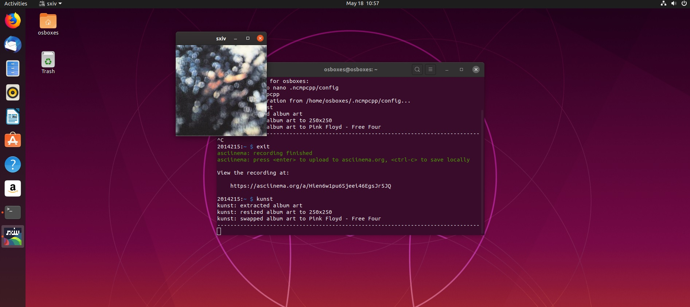

# ΙΟΝΙΟ ΠΑΝΕΠΙΣΤΗΜΙΟ, ΤΜΗΜΑ ΠΛΗΡΟΦΟΡΙΚΗΣ 
## ΜΑΘΗΜΑ
### Πολυμέσα  
Επιβλέπων καθηγητής: Χωριανόπουλος Κωνσταντίνος 

## Στοιχεία φοιτήτριας  
### Ιωάννα Ξυγκώρου
### ΑΜ: Π2014215

### Προσωπικό αποθετήριο https://github.com/p2014xygk/mm

## Εισαγωγή
Υλοποιήθηκαν 6 ασκήσεις σε linux terminal (4 + 2 επιπλέον αντί τελικής εξέτασης) και 4 παραδοτέα συμμετοχικού εκπαιδευτικού υλικού (2 + 2 επιπλέον αντι τελικής εξέτασης). Κάποιες ασκήσεις terminal εγιναν σε λειτουργικό raspbian buster σε raspberry pi χωρίς γραφικό περιβάλλον, κάποιες σε wsl (windows 10), και καποιες σε virtual box με Ubuntu 18.04. Σε όλες τις ασκήσεις υπάρχει url με την καταγραφή του asciinema, καθώς και url με πηγες απο όπου αντλήθηκε βοήθεια για την υλοποίηση στης άσκησης και τη ορθή χρήση του εκάστοτε εργαλείου. Όπου δεν ήταν δυνατή η καταγραφή του asciinema χρησιμοποιήθηκαν ενδεικτικές οθόνες (screenshots).

## Συμμετοχικό εκπαιδευτικό υλικό
### Αποθετήριο σελίδας βιβλίου: https://github.com/p2014xygk/gr
### url σελίδας βιβλίου https://p2014xygk-gr.netlify.app/

#### Παραδοτέο 2.Α
#### twitter account https://twitter.com/ioannaxygk
Έγιναν 10 tweets απο την σελίδα του βιβλίου στα οποία εκτός απο το url περιλαμβάνουν σχόλια gifs και hashtags.

##### 1. https://twitter.com/ioannaxygk/status/1263483643156103170
##### 2. https://twitter.com/ioannaxygk/status/1263483985910468608
##### 3. https://twitter.com/ioannaxygk/status/1263484511209340928
##### 4. https://twitter.com/ioannaxygk/status/1263485331841695751
##### 5. https://twitter.com/ioannaxygk/status/1263485505800417280
##### 6. https://twitter.com/ioannaxygk/status/1263485767994793985
##### 7. https://twitter.com/ioannaxygk/status/1263486624119304194
##### 8. https://twitter.com/ioannaxygk/status/1263487142287851520
##### 9. https://twitter.com/ioannaxygk/status/1263487784637149185
##### 10. https://twitter.com/ioannaxygk/status/1263488346162171904

#### Παραδοτέο 2.Β
Έγιναν αλλαγές ώστε να γίνει η ιστοσελίδα του βιβλίου πιο φιλική προς τα social media. Προστέθηκε η δυνατότητα να γίνονται share τα posts στα social media (twitter, facebook, linkedIn), μια λειτουργία που υπάρχει πλέον σε όλες τις ιστοσελίδες πλέον. Επίσης προστέθηκε twitter feed στο footer της σελίδας, το οποίο περιέχει τα tweets του παραδοτέου 2.Α.

#### Επιπλέον παραδοτέο 1.Β
Νέο διαδραστικό παράδειγμα: https://p2014xygk-gr.netlify.app/remix/background-mv-mouse/

#### Επιπλέον παραδοτέο 1.Γ.1
Νέα μελέτη περίπτωσης: Google analytics https://p2014xygk-gr.netlify.app/case-study/google-analytics/

##### Πηγές
https://en.wikipedia.org/wiki/Google_Analytics


### Άσκηση 1. Search, download and play (with the terminal) your favorite song of the month from youtube.

#### url asciinema: https://asciinema.org/a/GFoZ3wMsXTZkP2atO7kkKXl22

Για την άσκηση αυτή χρησιμοποίησα το youtube-dl και τον mpv player. Έκανα εγκατάσταση το youtube-dl και μαζί εγκαταστάθηκε και ο mplayer.

```
sudo apt-get install youtube-dl
```

Το τραγούδι που επέλεξα να κατεβάσω είναι το Shallow (Lady Gaga, Bradley Cooper) https://www.youtube.com/watch?v=bo_efYhYU2A, και το κατέβασα με την εντολή

```
youtube-dl -x --audio-format mp3 https://www.youtube.com/watch?v=bo_efYhYU2A
```

Έκανα αναπαργωγή του τραγουδιού με τον mpv με πληκτρολογώντας

```
mpv <filename>
```

Οδηγίες σχετικά με τη χρήση του youtube-dl βρηκα απο το παρακάτω url
https://www.tecmint.com/download-mp3-song-from-youtube-videos/

### Άσκηση 2. Download a torrent

#### url asciinema: https://asciinema.org/a/lkQD9eFiqlLW9CIcghx9ln7KN

Για την άσκηση αυτή χρησιμοποίησα το aria. Οδηγίες και βοήθεια σχετικά με την εγκατάσταση και λειτουργία βρήκα στο https://www.addictivetips.com/ubuntu-linux-tips/download-torrents-from-the-command-line-linux/

Η εγκατασταση έγινε με την εντολή 

```
sudo apt-get install aria
```

και το torrent κατέβηκε με την εντολή

```
aria2c <url or magnet>
```

Επέλεξα να κατεβάσω το λειτουργικό raspbian noobs lite για το raspberry pi το οποίο βρήκα στην διεύθυνση https://www.raspberrypi.org/downloads/noobs/

### Άσκηση 3. Manage your music library. Import your music library, add tags and delete/add songs.

#### url asciinema: https://asciinema.org/a/1CkoGY32Uhp8TJXoT4Djg6LDv

Για την άσκηση αυτή χρησιμοποιήθηκε το beets. Και για τις ανάγκες της εργασίας πριν αρχίσω το recording εφτιαξα δύο directories music και more_music στα οποία έβαλα μουσική για να εισάγω στο beets. H εγκατάσταση του beets έγινε με την εντολή

```
sudo apt-get install beets
```

στη συνέχεια δημιούργησα άλλα δυο directories. new_music, όπου μεταφέρονται τα imported κομμάτια στο beets και ένα library όπου θα υπάρχει το database του beets. Για να ρυθμίσεις σε ποιον φάκελο θα είναι η database και τα κομμάτια πρέπει να επεξεργαστείς το config.yaml του beets. για να βρώ που είναι το αρχείο έτρεξα την εντολή

```
beet config -p
```

και προσθεσα

```
directory: ~/new_music
library: ~/library/library.blb
import:
    move: no
    copy: yes
```

παραπάνω λέμε στο beets που θα αποθηκεύσει τη βάση και τα κομμάτια καθώς και ότι δεν θέλουμε να μεταφέρει τα κομμάτια αλλα να τα αντιγράψει ώστε να υπάρχουν και στον αρχικό μας φάκελο.

για να εισάγεις κομμάτια στο beets πληκτρολογείς την εντολή

```
beet import /path/to/your/music/folder
```

Το beets βρίσκει απο μόνο του όλα τα απαραίτητα tags και τα προσθέτει αυτόματα, οστόσο μπορείς να προσθέσεις η να τα αλλάξεις με την εντολή 

```
beet modify <artist> <tag>="new tag"
```

Μπορείς να διαγράψεις κομμάτι με την εντολή

```
beet remove title:'song title'
```

### Άσκηση 4. Batch image conversion. Convert your image files to different sizes and formats.

#### url asciinema: https://asciinema.org/a/XD5Pde6qThhZ60h0CjmISTx6l

Για την άσκηση αυτή χρησιμοποίησα το imagemagick. Και μείωσα το μέγεθος όλων των εικόνων μέσα στον φάκελο images κατα 50%. H πρακτική αυτή είναι ιδανική όταν δουλεύεις με περιεχόμενο το οποίο πρέπει να ανέβει σε μια ιστοσελίδα, Θες οι εικόνες να είναι οσο το δυνατόν μικρότερες σε μέγεθος χωρίς να χάσουν αισθητά την ποιότητά τους. Συνήθως η δουλειά αυτή γίνετε με λογισμικά όπως το photoshop. Με το imagemagick είναι πολύ πιο εύκολο. Εγκατέστησα το imagemagick με την εντολή

```
sudo apt-get install imagemagick
```

Δημιούργησα νέο φάκελο resized_images μεσα στον φάκελο images, όπου είναι οι εικόνες και χρησιμοποίησα την εντολή mogrify.

```
mogrify -path resized_images -adaptive-resize 50% -quality 60% *
```
Στην παραπάνω εντολή δίνουμε το όνομα του directory που θέλουμε να αποθηκευτούνε ει εικόνες μας, ορίζουμε το ποσοστό του resize και της ποιότητας που θέλουμε (κάτι σαν το save for web and devices του photoshop).

Η διαφορά στα μεγέθη των αρχείων φαίνεται ξεκάθαρα με την εντολή

```
ls -lh
```

Τέλος επέλεξα μία εικόνα απο τις νέες εικόνες που δημιουργήθηκαν για να την μετατρέψω απο jpg σε png. Για τον σκοπό αυτό δημιούργησα νέο directory PNG μεσα στο resized_images, και ετρεξα την εντολή

```
convert name.jpg PNG/name.png
```

Πηγές άντλησης δεδομένων και βοήθειας:
https://www.youtube.com/watch?v=-hPleOyZJr4

### Επιπλέον άσκηση 5. Visualize an mp3. Demonstrate album art and visualizations with an mp3 player and various songs.
#### url asciinema: https://asciinema.org/a/Hien6w1pu6Sjeei46EgsJr5JQ
Εγκατέστησα το mpd και το ncmpcpp. Χρησιμοποίησα το ncmpccp γιατι έχει τη δυνατότητα visualisation. H ρύθμιση του visualisation φαίνεται στην καταγραφή του asciinema.

```
sudo apt-get install mpd ncmpcpp
```

Τα configuration φαίνονται στην καταγραφή του acsiinema. Χρησιμοποίησα μουσική που πέρασα στον φακελο Μusic του home directory μου.
εγκατέστησα τον kunst και όλα τα dependencies που χρειάστηκαν. Στην ενδεικτική εικόνα φαινεται το παράθυρο με το cover του album απο το κομμάτι που παίζει.



##### πηγές
https://github.com/sdushantha/kunst

https://wiki.archlinux.org/index.php/Ncmpcpp

https://linuxconfig.org/configuring-the-mpd-music-server-on-ubuntu-linux

### Επιπλέον άσκηση 6. Create a simple website with a static generator. Single page with name-AM-github and links to your asciinema deliverables.
#### url asciinema: https://asciinema.org/a/9j870YnkMTNYCTWHWqGgxdFJt
#### Αποθετήριο σελίδας https://github.com/p2014xygk/my_deliverables
#### url σελίδας https://p2014xygk-my-deliverables.netlify.app/
Δημιουργησα τη στατική σελίδα με το jekyll όπως φαίνεται στην καταγραφή του asciinema και εκανα push τα αρχεία στο github όπου ανέβασα την σελίδα με το netlify.

##### Πηγές
https://jekyllrb.com/

https://help.github.com/en/github/importing-your-projects-to-github/adding-an-existing-project-to-github-using-the-command-line

## Συμπεράσματα
Μέσα από τη διαδικασία υλοποίησης των 6 συνολικά ασκήσεων εξοικειώθηκα με το terminal των linux, και έμαθα να χρησιμοποιώ σημαντικά εργαλεία, αλλα και πως λειτουργεί γενικά το σύστημα. file structure, δικαιώματα χρηστών κ.α. Απο τις αναζητήσεις στο internet σχετικά με την εγκατάσταση και την λειτουργία των εργαλέιων κατάλαβα ότι πολλά πραγματα διαφέρουν σε κάθε σύστημα (linux distribution). Οι γνώσεις που αποκτήθηκαν είναι σημαντικές καθώς πολλές διαδικτυακές εφαρμογές τρέχουν σε linux, και είναι σημαντικό να γνωριζεις πως λειτουργεί το συστημα, κυρίως μέσω terminal.
