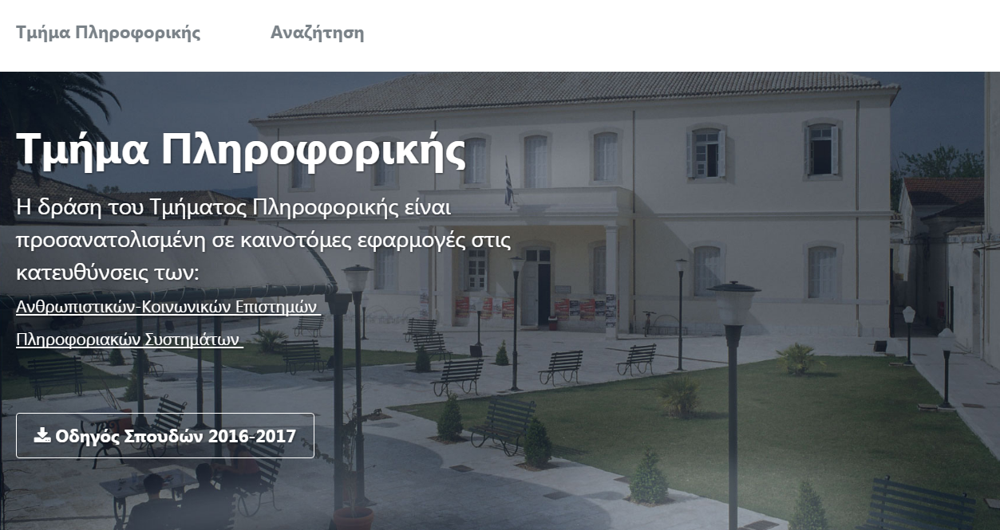

# ΠΟΛΥΜΈΣΑ
## ΙΩΆΝΝΗΣ ΑΓΓΈΛΗΣ
## ΑΜ:Π2015006

# ΕΠΙΛΟΓΉ ΕΡΓΑΣΊΑ : site-bilingua

# ΑΝΑΦΟΡΑ 

### Σε αυτό το μάθημα έμαθα:
Προσπάθησα να μάθω να  χειρίζομαι το GitHub μέσα από το git ένα πολύ πιο δυνατό εργαλείο μιας και για κάθε commit και pull request θα πρέπει να δίνεις τις κατάλληλες εντολές στο τερματικό. Η τεχνολογία που χρησιμοποιούμε για την σελίδα είναι ψεφτοδυναμική χρησιμοποιώντας τα εργαλεία Jekyll,Jekyll multilingual και  Liquid σε συνδυασμό με HTML. Ο συνδυασμός αυτών των εργαλείων παράγει εκπληκτικά αποτελέσματα σε θέματα αποδόσεων αλλά είναι αρκετά περιπλοκά και θέλουν χρόνο για την κατανόηση τους. Το συνεργατικό περιβάλω που υπάρχει  είναι καλό καθώς οι υπό εργασίες είναι κατανεμημένες και αυξάνετε έτσι η ποιοτική επέκταση της ιστοσελίδας μας.  Μέτα από κάποιο διάστημα μεταπηδήσαμε σε gem τα προσπάθησαν φτιάξη η ομάδα.  Έμαθα επισης τη είναι Ruby gems και τα plugins.

### Αναλυτικά:
Σε αυτό το εξάμηνο ασχολήθηκα με την εργασία κατασκευής της ιστοσελίδας του Τμήματος Πληροφορικής.Προσωπικά δεν έχω ασχοληθεί με την κατασκευή ιστοσελίδων και είναι η πρώτη ιστοσελίδα που κατασκευάζω.Στην αρχή συνάντησα πολλές δυσκολίες και έπρεπε να καταλάβω πώς λειτουργεί Liquid, μιας και έχει περίεργο συντακτικό.Ένα επόμενο βήμα που θέλω να κάνω είναι καταφέρω να τρέξω την σελίδα τοπικά και μέτα στέλνω τις αλλαγές στο αποθετήριο του κώδικα . Σε αυτό το βήμα το δουλεύω καθώς πρέπει μεταβώ σε λειτουργικό σύστημα Unix 
γιατί μου δίδει περσότερη ευελιξία .
### Συνεισφορά:
Μετέφερα ένα τεράστιο μέρος της εναπομείναντας πληροφορίας από το αρχικό site στο site το οποίο φτιάχνουμε, εμφανίζεται μέσω των Markdown αρχείων. Δηλαδή πρόσθεσα τις σελίδες για τα εναπομείναντα μαθήματα και τους καθηγητές στα ελληνικά και στα αγγλικά.Επίσης έγραψα τον πρώτο μου κώδικα Liquid για να μπορέσουν να λειτουργήσουν τα κουμπιά των κατευθύνσεων όπου το κάθε κουμπί σε πήγαινε σε μία καινούργια σελίδα που περιέχονταν τα αντίστοιχα μαθήματα κάθε κατεύθυνσης. Συναντήθηκαν αρκετές δυσκολίες μιας και έπρεπε να καταλάβω την αρχιτεκτονική της σελίδας από πίσω και πώς λειτουργεί.Στο site-gem πρόσθεσε τις φωτογραφίες από κάθε εργαστήριο που είναι ενεργό στο τμήμα μας.

[Ανθρωπιστικών-Κοινωνικών Επιστημών](https://giannis-aggelis.github.io/site-bilingual/gr/humanistic/)
[Πληροφοριακών Συστημάτων](https://giannis-aggelis.github.io/site-bilingual/gr/systems/)

### Μελλοντική συνεισφορά:
Σκοπεύω τα επόμενα εξάμηνα να ξαναπάρω αυτή την εργασία και να προσπαθήσω να συνεισφέρω όσο μπορώ αλλά για να μάθω καινούργια πράγματα. Επίσης ιστοσελίδα που θα βγει στο τέλος όταν ολοκληρωθεί θα είναι για το τμήμα μας.

# Bonus Email dsa11999977@gmail.com PoM 
