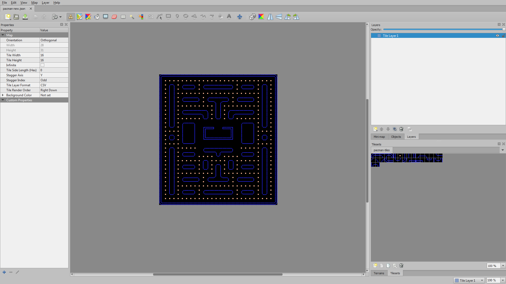

#Δημιουργία Pacman,Ανδρέας Σιώτας <Π2015008>
##Παραδοτέο 1 

Αποθετήριο:https://github.com/siotasandreas/pacman

Εκτελέσιμο:https://siotasandreas.github.io/pacman/

##Παραδοτέο 2

Δημιούργησα την πίστα μου με το Tiled χρησιμοποιώντας το tileset που μου δόθηκε (pacman_tiles).

Άλλαξα το χαρακτήρα μου σε συννεφάκι χρησιμοποιώντας πάλι το Tiled (3 width,1 height/32x32 pixel το καθένα)

Άλλαξα τα dots που τρώει σε φράουλες(16x16 pixel)

Πρόσθεσα μουσική και ήχο κάθε φορά που τρώει μια φράουλα!

Τέλος πρόσθεσα score κάτω αριστερά στην πίστα!

##Παραδοτέο 3

...

##Παραδοτέο 4 - Tελική Αναφορά

...
