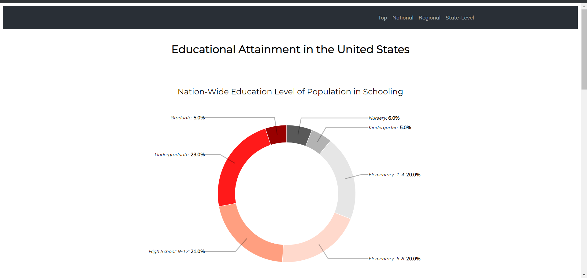
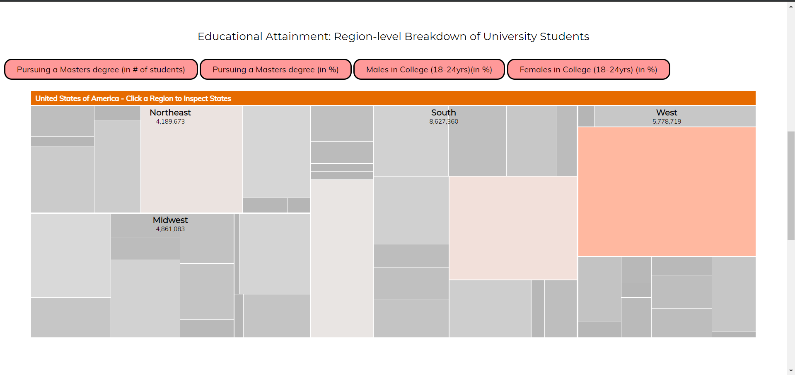
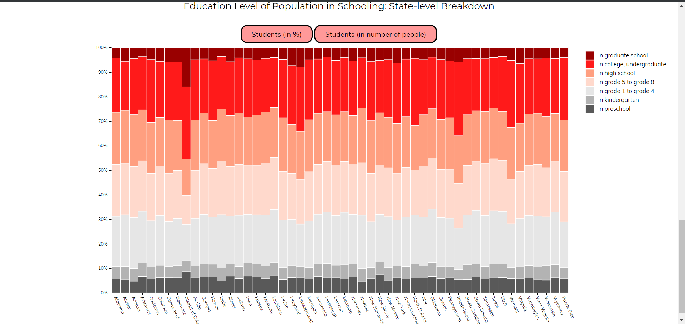

# ΙΟΝΙΟ ΠΑΝΕΠΙΣΤΗΜΙΙΟ
## ΜΑΘΗΜΑ Ε΄ ΕΞΑΜΗΝΟΥ : ΠΟΛΥΜΕΣΑ
ΟΝΟΜΑ: Δεληβέρη Κωνσταντίνα  
ΑΜ: Π2015020

 ### ΚΑΘΗΓΗΤΗΣ
Χωριανόπουλος Κ.

# Επιλογή Εργασίας Περιεχομένου

Link Social Media : https://twitter.com/KDeliveri

Εκτελέσιμο link ιστοσελίδας: https://konstantinadeliveri.github.io/gr/

Αποθετήριο κώδικα ιστοσελίδας: https://github.com/konstantinadeliveri/gr

## Link αναρτήσεων:
1) https://twitter.com/KDeliveri/status/1067083695394308097
2) https://twitter.com/KDeliveri/status/1067085120853676032
3) https://twitter.com/KDeliveri/status/1067087140214005761
4) https://twitter.com/KDeliveri/status/1067088225976664065
5) https://twitter.com/KDeliveri/status/1067090188869017600
6) https://twitter.com/KDeliveri/status/1067091836232261632
7) https://twitter.com/KDeliveri/status/1067093890023464960
8) https://twitter.com/KDeliveri/status/1067096056981266433
9) https://twitter.com/KDeliveri/status/1067099157616304128
10) https://twitter.com/KDeliveri/status/1067107326535102465

## Επιλογή Θέματος: Δημιουργία Shooter

## Παραδοτέο 1

### Link για εκτελέσιμο: https://konstantinadeliveri.github.io/Shooter/
### gh-pages Repository: https://github.com/konstantinadeliveri/Shooter/tree/gh-pages
### Forked Repository: https://github.com/konstantinadeliveri/Shooter/tree/master

- [x] Initial settings (όπως περιγράφονται στο README.md του repository)
- [x] Link του παιχνιδιού στην αναφορά
- [x] Πρόσθεσε ήχους (shooting, explosions, κτλ.) και μουσική.
- [x] Πρόσθεσε την πρώτη κατηγορία εχθρών σύμφωνα με τα steps 12-17 από τις οδηγίες. Για την συγκεκριμένη κατηγορία εχθρών χρησιμοποίησε την εικόνα enemy2.png αντί για την εικόνα green-enemy.png. Προσοχή: πρέπει να μελετήσετε τον κώδικα και να τον τροποποιήσετε κατάλληλα ώστε η συμπεριφορά των εχθρών να είναι ίδια αλλά να έρχονται από τα δεξιά προς τα αριστερά της οθόνης και όχι από πάνω προς τα κάτω όπως περιγράφετε στις οδηγίες.
- [x] Επέκτεινε το παιχνίδι ώστε να προσθέσεις ζωή και score ακολουθώντας τα steps 18-20 από τις οδηγίες.
- [x] Ακολούθησε το step 21 από τις οδηγίες. Προσοχή: πρέπει να δημιουργήσεις από εδώ και να χρησιμοποιήσεις το δικό σου font .
- [x] Πρόσθεσε τη δεύτερη κατηγορία εχθρών σύμφωνα με τα steps 22-24 από τις οδηγίες. Για τη συγκεκριμένη κατηγορία εχθρών χρησιμοποίησε την εικόνα enemy3.png αντί για την εικόνα blue-enemy.png. Προσοχή: πρέπει να μελετήσετε τον κώδικα και να τον τροποποιήσετε κατάλληλα ώστε η συμπεριφορά των εχθρών να είναι ίδια αλλά να έρχονται από τα δεξιά προς τα αριστερά της οθόνης και όχι από πάνω προς τα κάτω όπως περιγράφετε στις οδηγίες.
 
## Παραδοτέο 2
- [x] Επεκτείνετε το παιχνίδι ώστε να αναβαθμίζονται τα όπλα του παίχτη σύμφωνα με τα steps 25-26 από τις οδηγίες. Προσοχή: πρέπει να μελετήσετε τον κώδικα και να τον τροποποιήσετε κατάλληλα ώστε η αναβάθμιση να μην γίνεται σύμφωνα με το score αλλά όταν ο παίχτης συλλέγει κάποιο αντικείμενο που εμφανίζεται στην πίστα. Επίσης να υπάρχουν παραπάνω από δυο κατηγορίες αναβαθμίσεων. Επιπλέον tutorial.
 - [x] Προσθήκη Μenu στην αρχή για επιλογή πίστας και start of level. Δημιουργία τουλάχιστον δυο συνεχόμενων levels. Όταν ο πρωταγωνιστής ολοκληρώνει με επιτυχία το πρώτο level το παιχνίδι να συνεχίζει στο επόμενο. Το δεύτερο level θα πρέπει να είναι δυσκολότερο και να χρησιμοποιήσετε διαφορετικούς εχθρούς (new enemies, asteroids κτλ.). Μπορείτε να μελετήσετε τον κώδικα μιας περσινής εξαιρετικής εργασίας για να πάρετε μια ιδέα πως μπορείτε να υλοποιήσετε το συγκεκριμένο ζητούμενο.
 - [x] Προσθήκη ενός μεγάλου εχθρού στο τέλος του level. Μια ιδέα μπορείτε να πάρετε από εδώ. Είστε ελεύθεροι να επιλέξετε την εικόνα και τη συμπεριφορά του μεγάλου εχθρού.
 - [x] Τελική αναφορά την εργασίας που θα πρέπει απαραίτητα να περιλαμβάνει link του παιχνιδιού.
 
 

# Τελική Αναφορά

### Τίτλος: Βίντεο-Παιχνίδι Shooter 

#### Ονοματεπώνυμο και Α.Μ:
- Δεληβέρη Κωνσταντίνα 
- Π2015020
### Link Εργασίας Ανάπτυξης:

#### Link για εκτελέσιμο: https://github.com/konstantinadeliveri/Shooter
#### gh-pages Repository: https://github.com/konstantinadeliveri/Shooter/tree/gh-pages
#### Forked Repository: https://github.com/konstantinadeliveri/Shooter/tree/master

### Link Εργασίας Περιεχομένου:

#### Link Social Media : https://twitter.com/KDeliveri

#### Εκτελέσιμο link ιστοσελίδας: https://konstantinadeliveri.github.io/gr/

#### Αποθετήριο κώδικα ιστοσελίδας: https://github.com/konstantinadeliveri/gr

#### Link αναρτήσεων:
1) https://twitter.com/KDeliveri/status/1067083695394308097
2) https://twitter.com/KDeliveri/status/1067085120853676032
3) https://twitter.com/KDeliveri/status/1067087140214005761
4) https://twitter.com/KDeliveri/status/1067088225976664065
5) https://twitter.com/KDeliveri/status/1067090188869017600
6) https://twitter.com/KDeliveri/status/1067091836232261632
7) https://twitter.com/KDeliveri/status/1067093890023464960
8) https://twitter.com/KDeliveri/status/1067096056981266433
9) https://twitter.com/KDeliveri/status/1067099157616304128
10) https://twitter.com/KDeliveri/status/1067107326535102465

### Περίληψη Εργασίας Ανάπτυξης
Η εργασία μας αφορά την μελέτη, τροποποίηση και ανάπτυξη κώδικα σχετικά με το βίντεοπαιχνίδι Shooter. Ακολουθώντας πιστά τις οδηγίες των παραδοτέων καταφέραμε να τροποποιήσουμε ένα HTML5 βιντεοπαιχνίδι χρησιμοποιώντας τη βιβλιοθήκη Phaser. Μέσω της πλατφόρμας Github κάναμε λοιπόν τις απαραίτητες αλλαγές ώστε να φτάσουμε στο επιθυμητό αποτέλεσμα της εργασίας, χρησιμοποιώντας τα μέσα που μας δώθηκαν, καθώς και πρόσθετο υλικό από το διαδίκτυο. 

### Εισαγωγή Εργασίας Ανάπτυξης
Σκοπός της εργασίας είναι η εξοικείωση των φοιτητών με τη γλώσσα HTML καθώς και με τη βιβλιοθήκη Phaser. Μετά από μελέτη του αρχικού κώδικα και παραπλήσιων, ξεκίνησε η διαδικασία της μετατροπής σύμφωνα με τις οδηγίες που μας δώθηκαν.
Αρχικά, έγινε αντιγραφή (fork) του αποθετηρίου του παιχνιδιού στο προσωπικό μου Github αποθετήριο.
Στη συνέχεια, έγινε αποθήκευση του link του παιχνιδιού και ξεκίνησε η υλοποίηση του πρώτου παραδοτέου. Τροποποιήθηκε έτσι ο κώδικας ώστε να προστέθηκαν ήχοι, εχθροί, ζωή, σκόρ. Στο δεύτερο παραδοτέο, επεκτείναμε το παιχνίδι, αναβαθμίζοντας τα όπλα, τους εχθρούς, τα level, και προσθέτοντας νέες επιθέσεις.

### Μέθοδος Εργασίας Ανάπτυξης
 Αφού αντιγράψαμε το αρχείο του παιχνιδιού στο προσωπικό μας Github αποθετήριο, συνεχίσαμε με την επεξεργασία του παιχνιδιού. Αρχικά, προστέθηκαν ήχοι, όπως background music, explosion sound, blaster sound, όπου πήραμε από το soundible.com.
Στη συνέχεια, ακολουθώντας τα steps 12-17 από τις οδηγίες προσθέσαμε τους εχθρούς που μας ζητήθηκαν enemy2 και με την ανάλογη επεξεργασία ακολουθούσαν πορεία από δεξιά προς τα αριστερά.
Επιπλέον, ακολουθώντας τα βήματα 18-20 από τις οδηγίες προσθέσαμε ζωή στο διαστημόπλοιο καθώς και το σκόρ του, το οποίο αυξάνεται κάθε φορά που πυροβολάει τους εχθρούς. 
 Κατα το δεύτερο παραδοτέο, έπρεπε να ακολουθήσουμε τα steps 25-26 τα οποία μας βοηθούσαν στην αναβάθμιση των όπλων, έτσι με την ανάλογη τροποποίηση ο παίκτης μαζεύοντας κάποια αντικείμενα από το παιχνίδι, στη συγκεκριμένη εργασία χρησιμοποιήθηκαν εικόνες από το OpenGameArt.org. Προστέθηκε επίσης, αρχική εικόνα background cover καθώς και menu με level 1 και level 2.
 Στο δεύτερο level προστέθηκε επιπλέον εμπόδιο, αστεροειδής , όπου με τις ανάλογες επεξεργασίες αποτελεί εμπόδιο για τον παίκτη. 
 Ακόμη έχει γίνει προσθήκη μεγάλου εχθρού στο τέλος κάθε level, όπου καλείται να νικήσει ο παίκτης για να πάει παρακάτω.
 
 
 ### Αποτελέσματα - Εικόνες Εργασίας Ανάπτυξης
  
 #### Το αρχικό παιχνίδι που μας δώθηκε
 
 
 
 #### Το επεξεργασμένο παιχνίδι του πρώτου παραδοτέου
 
 
 
 
 
 
 #### Το τελικό επεξεργασμένο παιχνίνδι
 
 
 
 
 
