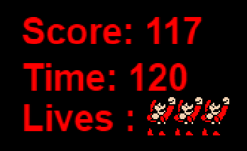

#PACMAN, Σεβαστιανός, Μέμος, Π2015027

##Παραδοτέο 1 
https://github.com/sevosmem/mm 
https://github.com/sevosmem/pacman 
https://sevosmem.github.io/pacman/ 

##Παραδοτέο 2
 Δημιούργησα μια νέα πίστα για το παιχνίδι χρησιμοποιώντας το Tiled.
  Άλλαξα την εμφάνιση του Pacman αντικαθιστώντας τον με τον Super Mario.
 Ο πρωταγωνιστής εκτός από dots μαζεύει και άλλα διάφορα αντικείμενα.
  Πρόσθεσα ήχους και μουσική.
 Επέκτεινα το παιχνίδι και πρόσθεσα score, χρόνο, bonus και ζωές.

##Παραδοτέο 3
 Πρόσθεσα εχθρούς. Οι εχθροί κινούνται τυχαία στην πίστα και μπορούν να φάνε τον πρωταγωνιστή.
 Έδωσα τη δυνατότητα teleport για τον πρωταγωνιστή σε συγκεκριμένα σημεία της πίστας.
 Ο πρωταγωνιστής μπορεί να αντιμετωπίσει τους εχθρούς.

##Παραδοτέο 4 - Tελική Αναφορά

PAC-MAN

Τελική αναφορά για την εργασία στο μάθημα Πολυμέσα. Η εργασία που επέλεξα να κάνω είναι η δημιουργία του κλασσικού παιχνιδιού Pacman, κάνοντας πολλές και διάφορες αλλαγές.

Δημιούργησα μια νέα πίστα για το παιχνίδι χρησιμοποιώντας το πρόγραμμα Tiled. Άλλαξα την εμφάνιση του Pacman αντικαθιστώντας τον με τον χαρακτήρα του Super Mario. Άλλαξα την εμφάνιση των coins. Πρόσθεσα ήχους και μουσική για την συλλογή των coins, στην συλλογή των bonus κλπ.

Επέκτεινα το παιχνίδι και πρόσθεσα score, χρόνο και ζωές.

Ακόμη πρόσθεσα bonus dot το οποίο εμφανίζεται και εξαφανίζεται μέσα στο χάρτη τυχαία δίνοντας στον πρωταγωνιστή τη δυνατότητα, αν προλάβει και το "φάει", να προσθέσει στο score του 50 επιπλέον πόντους.

Τέλος ο πρωταγωνιστής έχει τη δυνατότητα να κάνει teleport σε 4 διαφορετικά αλλά συγκεκριμένα σημεία του map δίνοντας του την δυνατότητα να μετακινείται πιο γρήγορα μέσα στον χάρτη.

Τα προγράμματα που χρειάστηκα και επέλεξα να χρησιμοποιήσω ήταν το Brackets για την ανάπτυξη του κώδικα, το Tiled για την δημιουργία του map, το Paint.net για την επεξεργασία των spitesheets και αναζήτηση spritesheets, εικονών, μουσικής και ήχων στο διαδίκτυο.

Τέλος τα συμπεράσματα μετά την ολοκλήρωση της εργασίας ήταν ότι έμαθα να χρησιμοποιώ σε καλό επίπεδο την βιβλιοθήκη Phaser και εξασκήθηκα στην σύνταξη κώδικα. Επίσης έμαθα να χρησιμοποιώ καλύτερα κάποια προγράμματα όπως το paint.net και το Tiled. Τέλος, εξοικειώθηκα στην χρήση του Github.

