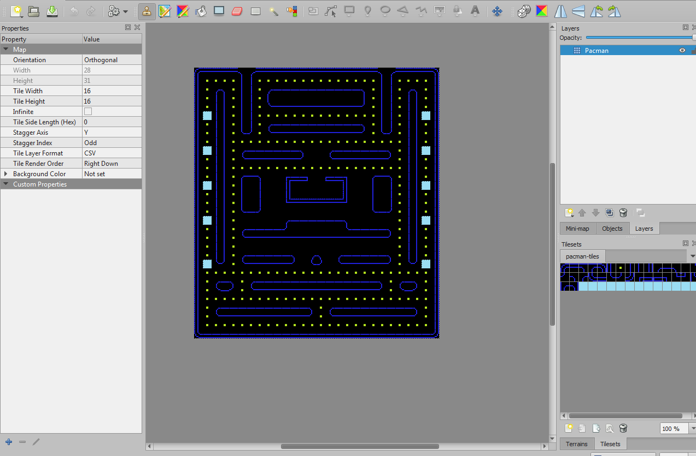
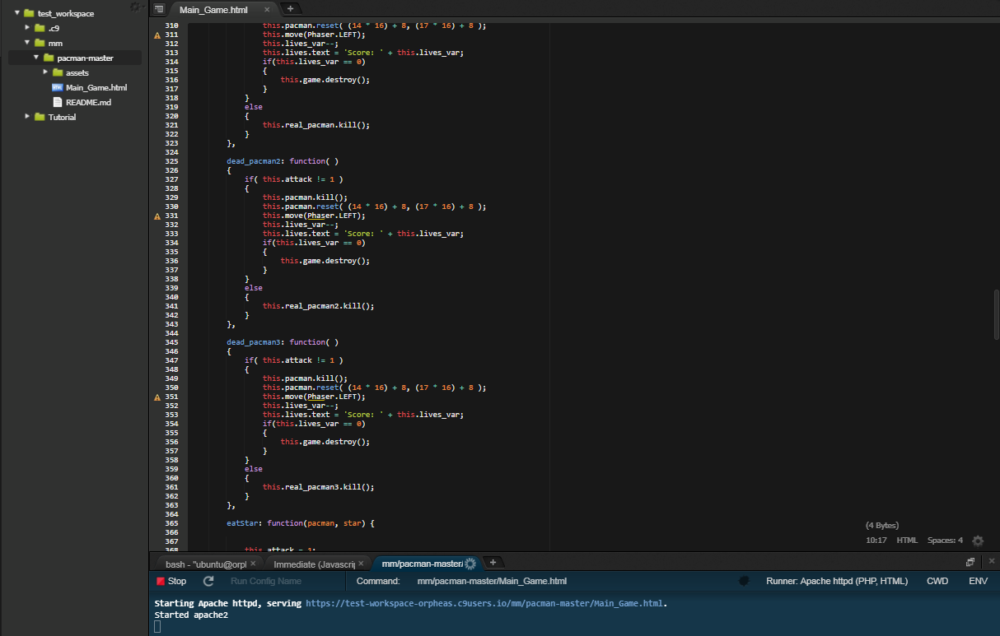
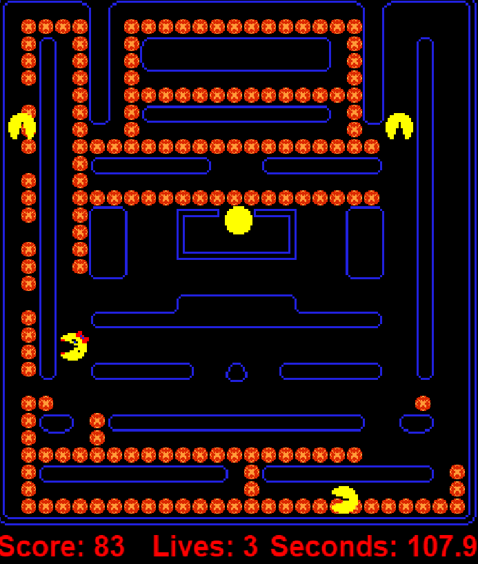
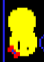

Pacman, Ορφέας, Γεωργίου, Π2015033

Παραδοτέο 1

https://github.com/p15geor1/mm 
https://github.com/p15geor1/pacman 
https://p15geor1.github.io/pacman/

Παραδοτέο 2

Για το παραδοτέο 1 διαμορφώθηκε καινούρια πίστα με το εργαλέιο Tiled, 
έγινε αλλαγή του χαρακτήρα του pacman με διαφορετικό καθώς και των dots,
προστέθηκε μουσική καθώς και score.

https://github.com/p15geor1/mm 
https://github.com/p15geor1/pacman 
https://p15geor1.github.io/pacman/

Παραδοτέο 3

https://github.com/p15geor1/mm 
https://github.com/p15geor1/pacman 
https://p15geor1.github.io/pacman/ 

Για να μπορέσω να βλέπω άμεσες αλλαγές χρησιμοποίησα το cloud 9.
Για το παραδοτέο 3 έγιναν βελτιστοποιήσεις στην πίστα με το εργαλείο Tiled, προστέθηκαν επιπλέον 
ειδικά αντικείμενα τα οποία εμφανίζονται και εξαφανίζονται σε τυχαία χρονικά διαστήματα, προστέθηκε 
επίσης χρόνος καθώς και ζωές. 
Προστέθηκαν εχθροί οι οποίοι κινούνται σε τυχαίες κατευθύνσεις και μπορούν να σκοτώσουν τον παίκτη,
όταν ο παίκτης φάει κάποιο ειδικό αντικείμενο τότε μπορεί για ένα χρονικό διάστημα να φάει τους εχθρούς. 
Τέλος προστέθηκε η δυνατότητα να τηλεμεταφέρεται ο παίκτης αυτόματα όταν προσπαθεί να μπεί στην βάση απο την οποία
βγαίνουν οι εχθροί.

 Η καινούρια πίστα:
 

 Tο cloud9:
 

 Το παιχνίδι:
  

Εδώ φαίνεται ο παίχτης να έρχεται σε επαφή με τον εχθρό:
  
αν ο παίχτης έχει πρώτα φάει το ειδικό αντικείμενο μπορεί να τον φάει αλλιώς πεθαίνει και χάνει μια ζωή,
όταν χαθούν και οι 3 ζωές το παιχνίδι τερματίζεται.

Παραδοτέο 4 - Tελική Αναφορά

...
