<h1>Pacman, Μανώλης, Τασιόπουλος, Π2015046</h1>

<h2>Παραδοτέο 1</h2>

 - Forked Repository 
  [Multimedia]: https://github.com/Manolis-Tasiopoulos/mm
  
  - Forked Repository
  [PacMan Repository]: https://github.com/Manolis-Tasiopoulos/pacman
  
  - GH-Pages
  [Pacman Game]: https://manolis-tasiopoulos.github.io/pacman/
 
<h2>Παραδοτέο 2</h2>

<h3>---LINKS---</h3>

   __Forked Repository__: https://github.com/Manolis-Tasiopoulos/pacman
  
   __RUN THE GAME__: https://manolis-tasiopoulos.github.io/pacman/
  
<h3>---ΑΛΛΑΓΕΣ ΠΟΥ ΕΓΙΝΑΝ ΣΤΟ ΠΑΙΧΝΙΔΙ---</h3>

   - __Δημιουργία νέου χάρτη με καινούργιο tileset__
   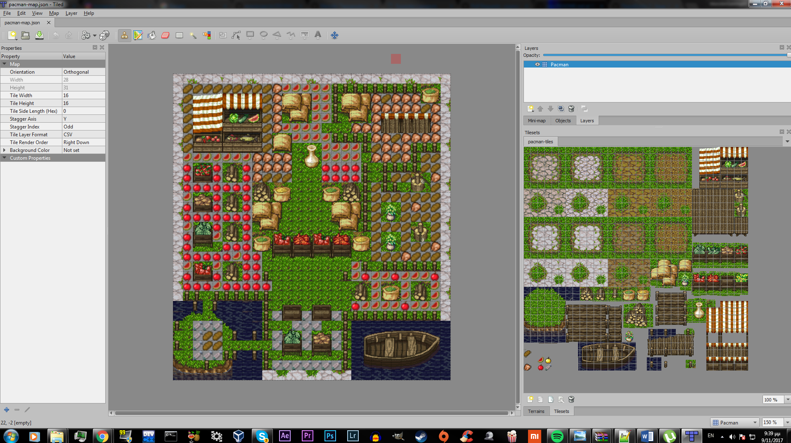
   ```
   Map
   ```
   - __Αλλαγή του χαρακτήρα "Pacman" με τον χαρακτήρα Link απο το κλασικό παιχνίδι "Legend Of Zelda"__ 
   
   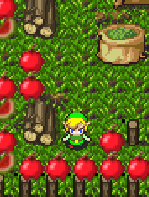
   ```
   LINK
   ```  
   - __Προσθήκη animation όταν ο χαρακτήρας κινείται προς οποιαδήποτε κατευθυνση__ 
        
      
 
 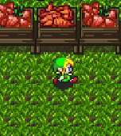 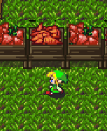
 
         
 - __Αλλαγη των Dots που θα μαζευει ο χαρακτηρας__ 
   
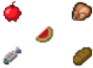
```
DOTS      
```

- __Προσθήκη Bonus:__
    * με τη μορφή χρυσού μήλου 
    * εμφανίζεται και εξαφανίζεται σε τυχαίες περιοχές του χάρτη κάθε 5 δευτερόλεπτα
    * Το bonus ισοδυναμεί με 50 πόντους που προστίθενται στο τελικό Score

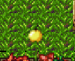
```
Bonus      
```

- __Προσθήκη ηχου__    
   * 8-bit ηχος για theme sound απο το σχετικό παιχνίδι "Legend Of Zelda"
   * Sound effect καθε φορα που ο παικτης συλλεγει ενα bonus
   
- __Προσθήκη Score Board για την εμφάνιση:__
   * Score
   * Χρόνου
   * Bonus
   * Ζωές
   
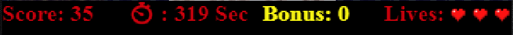
```
Score Board      
```

- __Εμφάνιση μηνύματος με τα αποτελέσματα και επαναφορά παιχνιδιου:__

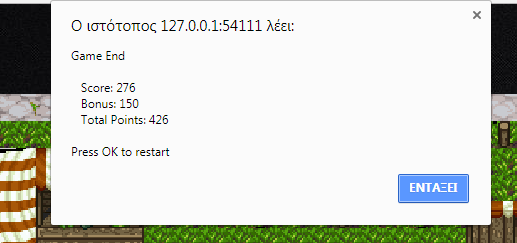
```
Score Board      
```

<h2>Παραδοτέο 3</h2>

<h3>---LINKS---</h3>

   __Forked Repository__: https://github.com/Manolis-Tasiopoulos/pacman
  
   __RUN THE GAME__: https://manolis-tasiopoulos.github.io/pacman/
  
<h3>---ΑΛΛΑΓΕΣ ΠΟΥ ΕΓΙΝΑΝ ΣΤΟ ΠΑΙΧΝΙΔΙ---</h3>

- __Αλλαγη των Dots που θα μαζευει ο χαρακτηρας__ 
   
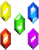
```
DOTS      
```

- __Προσθήκη Εχθρών__  
   * Με δικό τους AI που κινούνται τυχαία στο χάρτη
   * Εντοπίζουν το collision και προσαρμόζουν την κίνησή τους

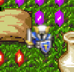
```
ΕΝΕΜΥ     
```
- __Αλλαγή του χαρακτήρα οταν πεθαίνει__
    * Διαφορετικό sprite 
    * ανάλογα με την κατεύθινση που πεθαίνει ο παίκτης

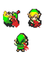    
```
DEATH     
```
- __Προσθήκη αντικειμένουν καταστροφης εχθρών__ 
   * Εμφανίζεται ανα 100 score + bonus
   * Υπάρχουν μονο 2 διαθέσιμα
   * Μόλις σκοτωθεί ένας εχθρός εξαφανίζεται
   
  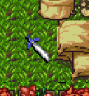     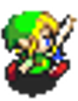   
 ```
      SWORD         LINK WITH SWORD     
 ```
  
- __Προσθήκη αντικειμένουν για teleport__  
   * Εμφανίζεται ανα 10 score + bonus
   * προσθέτονται και μπορούν να χρησιμοποιηθούν μαζί
   * εμφανίζονται συνεχώς
   * ενεργοποιείται με το space
   
   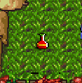 
   ```
   TELEPORT POTION    
   ```
- __Προσθήκη Side Screen__
   * Εμφανιζει τα διαθεσιμα swords
   * Εμφανιζει τα διαθεσιμα potions
   
    
   ```
   SIDE SCREEN    
   ```
- __Προσθήκη Splash Screens__
   * Main Menu
   
   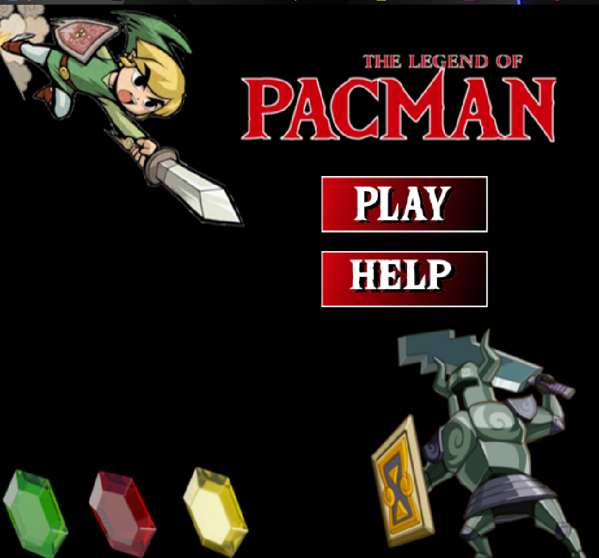 
   ```
   MAIN MENU    
   ```
   
   * Help Screen
   
   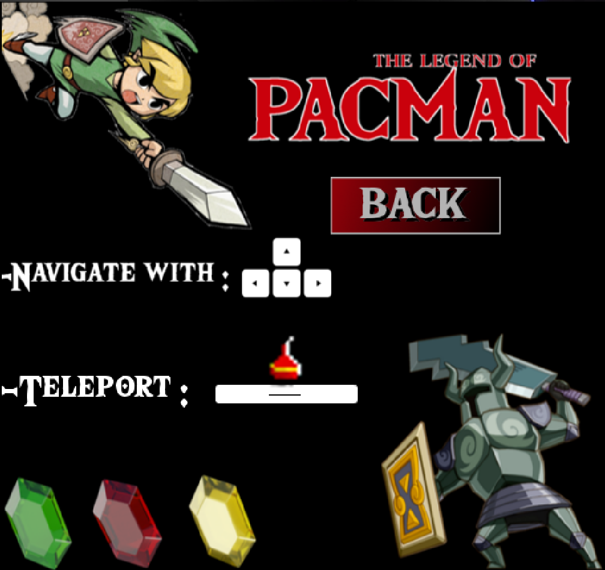 
   ```
   HELP SCREEN   
   ```
   
   * Game Over
   
   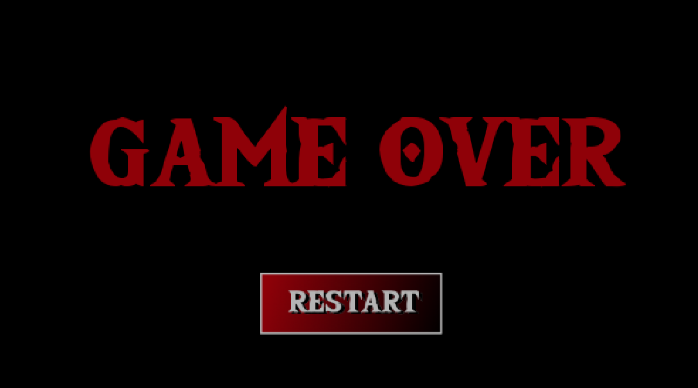 
   ```
   GAME OVER   
   ```

<h2>Παραδοτέο 4 - Tελική Αναφορά</h2>

...
