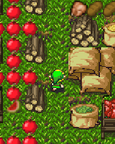

<h1>Pacman, Μανώλης, Τασιόπουλος, Π2015046</h1>

<h2>Παραδοτέο 1</h2>

 - Forked Repository 
  [Multimedia]: https://github.com/Manolis-Tasiopoulos/mm
  
  - Forked Repository
  [PacMan Repository]: https://github.com/Manolis-Tasiopoulos/pacman
  
  - GH-Pages
  [Pacman Game]: https://manolis-tasiopoulos.github.io/pacman/
 
<h2>Παραδοτέο 2</h2>

<h3>---LINKS---</h3>

   __Forked Repository__: https://github.com/Manolis-Tasiopoulos/pacman
  
   __RUN THE GAME__: https://manolis-tasiopoulos.github.io/pacman/
  
<h3>---ΑΛΛΑΓΕΣ ΠΟΥ ΕΓΙΝΑΝ ΣΤΟ ΠΑΙΧΝΙΔΙ---</h3>

   - __Δημιουργια νεου χαρτη με καινουργιο tileset__
   
   ```
   Map
   ```
   - __Αλλαγη του χαρακτηρα "Pacman" με τον χαρακτηρα Link απο το κλασικο παιχνιδι "Legend Of Zelda"__ 
   
   
   ```
   LINK
   ```  
   - __Προσθηκη animation οταν ο χαρακτηρας κινηται προς οποιαδιποτε κατευθινση__
        
      
 
  
 
         
 - __Αλλαγη των Dots που θα μαζευει ο χαρακτηρας__ 
   

```
DOTS      
```

- __Προσθηκη Bonus:__
    * με τη μορφη χρυσου μηλου 
    * εμφανιζεται και εξαφανιζεται σε τυχαιες περιοχες του χαρτη καθε 5 δευτερολεπτα
    * Το bonus ισοδιναμει με 50 ποντους που προστηθονται στο τελικο Score


```
Bonus      
```

- __Προσθηκη ηχου__    
   * 8-bit ηχος για theme sound απο το σχετικο παιχνιδι "Legend Of Zelda"
   * Sound effect καθε φορα που ο παικτης συλλεγει ενα bonus
   
- __Προσθηκη Score Board για την εμφανιση:__
   * Score
   * Χρονου
   * Bonus
   * Ζωες
   

```
Score Board      
```

- __Εμφανιση μινηματος με τα αποτελεσματα και επαναφορα παιχνιδιου:__


```
Score Board      
```

<h2>Παραδοτέο 3</h2>

...

<h2>Παραδοτέο 4 - Tελική Αναφορά</h2>

...
