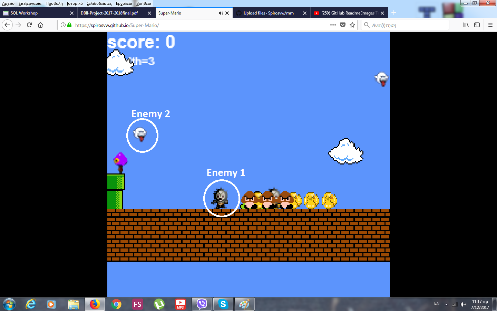
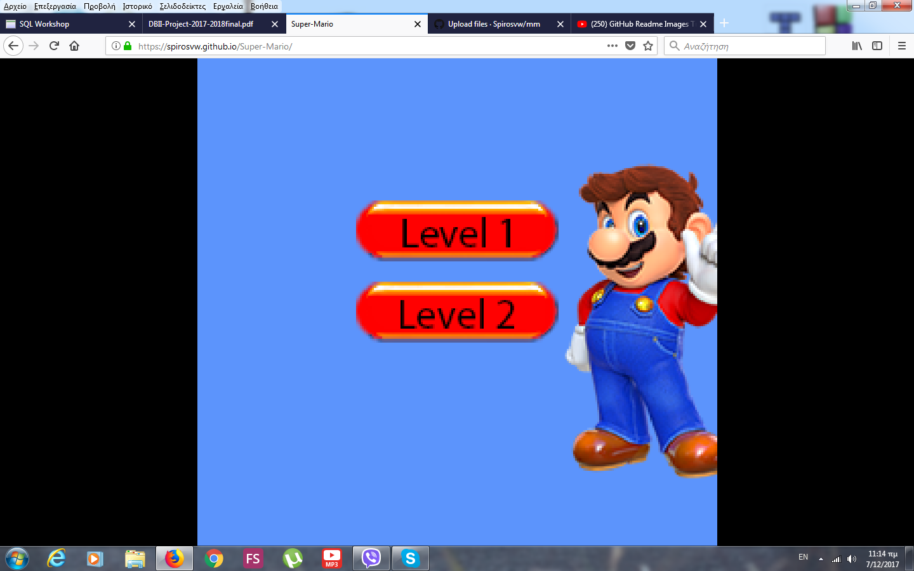
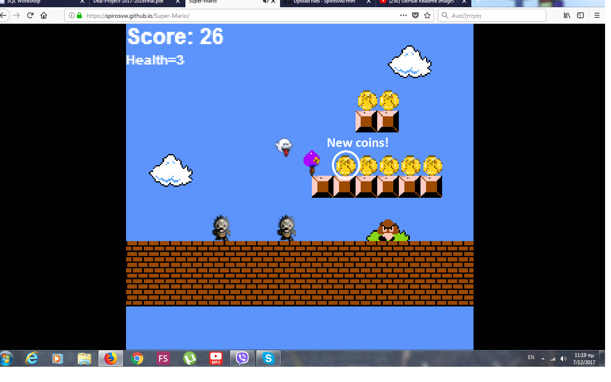
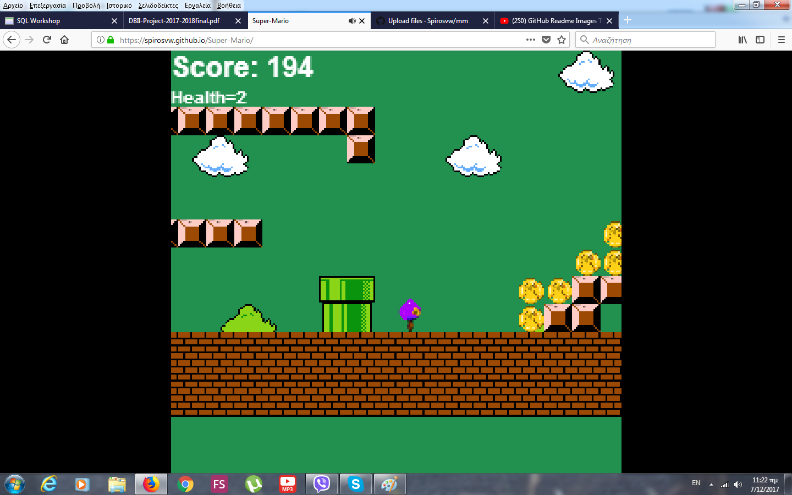

## ΠΟΛΥΜΕΣΑ

## Σπύρος Βέργης
## Π2015103

## Εργασία:Super Mario

 *Link master:https://github.com/Spirosvw/Super-Mario/tree/master
 
 *Link videogame:https://spirosvw.github.io/Super-Mario/
 
 *Link κώδικα:https://github.com/Spirosvw/Super-Mario/blob/master/index.html
## Παραδοτέο 2ο

# Δημιούργησα μια νέα πίστα για το παιχνίδι χρησιμοποιώντας το Tiled.
# Χρησιμοποίησα έναν άλλο χαρακτήρα για πρωταγωνιστή του παιχνιδιού.
# Άλλαξα την εμφάνιση των coins και το animation τους π.χ. θα μπορούσαν να περιστρέφονται
# Πρόσθεσα ήχους και μουσική.
# Πρόσθεσα score, bonus και ζωές.

Χρησιμοποίησα το ιδιο tileset και δημιούργησα μια νέα πίστα.
Χρησιμοποίησα άλλο χαρακτήρα για πρωταγωνιστή.
Άλλαξα τα coins και το animation.
Χρησιμοποίησα κάποιους ήχους του παιχνιδιού άλλα πρόσθεσα και νέους.
Πρόσθεσα score και ζωές. Tο bonus είναι μία έξτα ζωή κάθε 100 βαθμούς που κερδίζεις.

## Παραδοτέο 3ο

# Εισαγωγή Μενου
  Πρόσθεσα 3 κουμπιά πριν την εκκινηση της πιστας. Τα 2 πρώτα, level 1 και level 2, βοηθούν στην επιλογή της πίστας και όταν ένα απο αυτά επιλεχθεί εμφανίζεται  το τρίτο κουμπί(start game) οπού παρά ο παίκτης όταν είναι έτοιμος να ξεκινήσει.
# Προσθήκη Teleport
  Με το πάτημα του πλήκτρου space ο παίκτης μπορεί να επιστρέψει στην αρχική θέση του παιχνιδιού οποιαδήποτε στιγμή
# Προσθήκη εχθρών
  Enemy 1:Zombies Τα zombies κινούται οριζόντια τις πίστας με μεγάλη ταχύτητα. αν αγγίξουν τον παίχτη του αφαιρούν 2 ζωές αλλά δίνουν το διπλάσιο σκορ από τα goombas όταν σκοτωθούν.
  Enemy 2:Ghosts Τα ghosts  κινούνται ελέυθερα σε όλο τον χάρτη. Μόλις δούν τον παίχτη να πλησιάζει, τον κυνηγούν. Όταν ο παίκτης αγγίξει ένα ghost τότε γίνεται cursed για 4 δευτερόλεπτα. Στα 4 δευτερόλεπτα το πληλόγιο αναστρέφεται και η οθόνη γίνεται πράσινη.
# Προσθήκη animation 
  Στο τέλος της πίστας ο κεντρικός χαρακτήρας γυρίζει προς τον παίκτη και εμφανίζεται στην οθόνη το μύνημα "You won"
  
## Παραδοτέο 4ο

# Δημιουργία 2 συνεχόμενων level
  Δημιούργησα δεύτερο level. Στο τέλος του level 1 ο παίκτης μεταφέρεται στο level 2 και συνεχίζει κανονικά. Στο τέλος του level 2 εμφανίζεται στην οθόνη το μύνημα "You won".
  
# Pull request του gh-pages
  Ανέβασα την νέα πίστα μαζί με το tileset της στο repository του gh pages και έκανα pull request.
  
  
# Τελική μορφή παιχνιδιού

  Η μετατροπή αυτή του Super Mario αποτελείται απο 2 επίπεδα.Με την εκκίνηση του παιχνιδιού 2 κουμπιά εμφανίζονται στην οθόνα μαζί με μία εικόνα. Αυτό ειναι το αρχικό μενού. Το κάθε κουμπί αντιπροσωπεύει 1 level όταν ο παίκτης επιλέξει ένα από τα 2 επίπεδα, φορτώνει το level και ξεκινάει. Το παιχνίδι είναι σχετικά απλό και οι μηχανισμοί δεν διαφέρουν από αυτους του super mario. Τα enemys που υπάρχουν στο παιχνίδι είναι 3:
  *gumbas: ο κλασσικός εχθρός του mario που απλά κινείται οριζόντια της πίστας
  *zombies: Παρόμοιος εχθρός με το gumba μόνο που κινείται πολύ πιο γρήγορα και τρώει 2 ζωες του παίκτη αν τον αγγίξει.
  *ghosts: Ο συγκεκριμένος εχθρός δεν μπορεί να βλάψει τον παίκτη. Όταν ένα ghost ακουμπήσει τον παίκτη, τα πλήκτρα με τα οποία      κινείται αντιστρέφονται για 4 δευτερόλεπτα κάνοντας δυσκόλη την κίνηση του χαρακτήρα.
  
  Το bonus που παρέχει το παιχνίδι στον παίκτη είναι μία ζωή για κάθε 100 πόντους που μαζεύει. Στο τέλος του πρώτου level ο παίκτης μεταφέρεται στο level 2 για να συνεχίσει. Μόλις φτάσει στο τέλος του level 2 εμφανίζεται το μύνημα "You won" στην οθόνη. Σε περίπτωση που ο παίκτης χάσει όλες του τις ζωές, επιστρέφει πάλι στην αρχή του πρώτου level. Εάν ο παίκτης επιθυμεί να επιστρέψει στην αρχή της πίστας πατάει απλά space οπού ο χαρακτήρας θα κάνει teleport στην αρχή του παιχνιδιού.

  
  ## Enemies 1 & 2
  
  
  ## Levels in menu
  
  
  ## Coins
  
  
  ## Cursed
  

  ## You won
  
