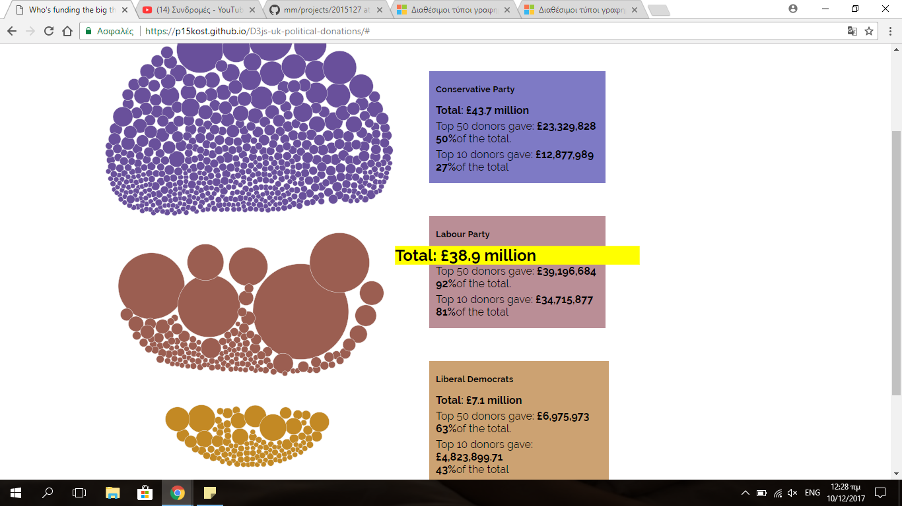
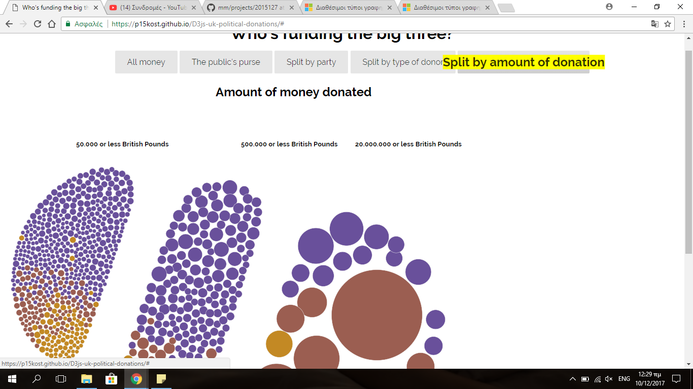

#Οπτικοποίηση δεδομένων χορηγιών (UK), Χαράλαμπος , Κωστάντης, ΑΜ <Π2015127>

##Παραδοτέο 1   
repository link :https://github.com/p15kost/D3js-uk-political-donations   
github pages link : https://p15kost.github.io/D3js-uk-political-donations/    
...

##Παραδοτέο 2  
-Πραγματοποιήθηκε αλλαγή χρωμάτων στις μπάλες που αντιπροσωπεύουν τα δεδομένα, όπως και στα 3 πεδία της ομαδοποίησης Split by Party.  
-Προστέθηκε ήχος στο πάτημα των κουμπιών ομαδοποίησης δεδομένων  
-Προστέθηκε η δυνατότητα αναζήτησης του δωρητή στο Google με το πάτημα της αντίστοιχης μπάλας-δεδομένων.  
...

##Παραδοτέο 3  
-Πραγματοποιήθηκε αλλαγή στον κώδικα ώστε το ποντίκι να λειτουργεί και ως μεγενθυντικός φακός όταν πηγαίνει πάνω από λέξεις του κειμένου (το ζουμ γίνεται ανά πρόταση/παράγραφο)  
-Πραγματοποιήθηκε τροποποίηση στον κώδικα ώστε όταν το ποντίκι βρίσκεται μέσα στον κύκλο ενός δωρητή να ακούγεται το όνομα του καθώς και το ποσό της δωρεάς του (text-to-speech)  
Δημιουργήθηκε μια νέα ομαδοποίηση των δεδομένων (βάση του ύψους της δωρεάς του-split by the donor amount)  
-Τροποποιήθηκε ο κώδικας, ώστε κατά τη λειτουργία του zoom, να αλλάζει το χρώμα του background ώστε να είναι πιο ευανάγνωστο το μεγενθυμένο κείμενο.  

Παρακάτω φαίνονται κάποια στιγμιότυπα-screenshots της εργασίας μου ως τώρα:

Στο παρακάτω στιγμότυπο φαίνονται τα νέα χρώματα των μπαλών-δεδομένα, τα νέα χρώματα των πλαισίων Conservative Party, Labour Party, Liberal Democrats της ομαδοποίησης split-by-party, όπως και η λειτουργία  του zoom πάνω το κείμενο (κείμενο με κίτρινο φόντο):  

 

Στο παρακάτω στιγμότυπο φαίνεται η νέα ομαδοποίηση των δεδομένων (βάση του ύψους της δωρεάς του-split by the donor amount):  

 

...

##Παραδοτέο 4 - Tελική Αναφορά

...
