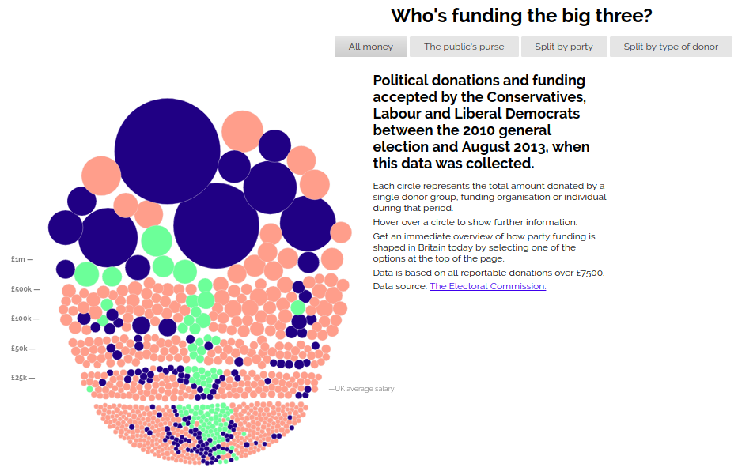
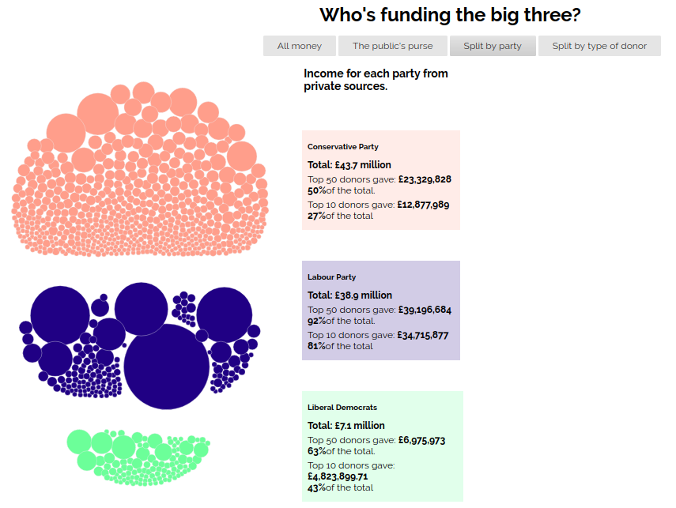

# Ιόνιο Πανεπιστήμιο

# Τμήμα Πληροφορικής

## Πολυμέσα

## Οπτικοποίηση δεδομένων χορηγιών (UK)

## Γιώργος Μαργαρίτης ΑΜ Π2015139

## Παραδοτέο 1

Έγινε μετονομασία του full-viz.html σε index.html ώστε το url της εφαρμογής να μην καταλήγει σε .html

Εφαρμογή: https://gmargaritis.github.io/D3js-uk-political-donations/

Αποθετήριο εφαρμογής: https://github.com/gmargaritis/D3js-uk-political-donations

## Παραδοτέο 2

### Πραγματοποιήθηκε αλλαγή χρωμάτων στις μπάλες με τα δεδομένα 

**Link:**
[chart.js](https://github.com/gmargaritis/D3js-uk-political-donations/blob/af8cacba5d4ad43a223fe1f063449d205f273cce/chart.js#L24)

### Πραγματοποιήθηκε αλλαγή στα 3 πεδία της ομαδοποίησης Split by party

**Link:**
[style.css](https://github.com/gmargaritis/D3js-uk-political-donations/blob/724cba7601d666149a09aa6bf1749c2be667d8a9/style.css#L66)

### Προστέθηκε ήχος κάθε φορά που ο χρήστης της εφαρμογής κάνει κλικ σε μία από τις επιλογές

**Link:**
[index.html](https://github.com/gmargaritis/D3js-uk-political-donations/blob/daecda3c5a9042609de0cddf665199f6c5353d16/index.html#L48)

### Τροποποιήθηκε ο κώδικας, έτσι ώστε όταν ο χρήστης κάνει κλικ σε κάποια μπάλα να ανοίγει ένα νέο παράθυρο με τα αποτελέσματα της αναζήτησης στο google για τον αντίστοιχο δωρητή.

**Link:**
[chart.js](https://github.com/gmargaritis/D3js-uk-political-donations/blob/af8cacba5d4ad43a223fe1f063449d205f273cce/chart.js#L95)

### Εφαρμογή
 https://gmargaritis.github.io/D3js-uk-political-donations/

### Αποθετήριο εφαρμογής
 https://github.com/gmargaritis/D3js-uk-political-donations

## Παραδοτέο 3

### Δημιουργήθηκε νεο view Split by amount of donation

**Links:** 

### Εφαρμογή
 https://gmargaritis.github.io/D3js-uk-political-donations/

### Αποθετήριο εφαρμογής
 https://github.com/gmargaritis/D3js-uk-political-donations
