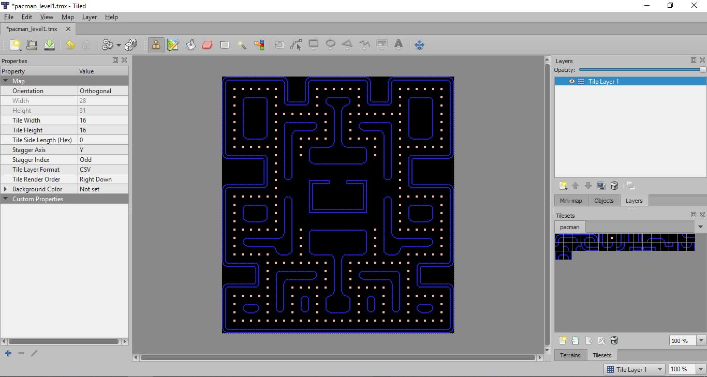
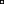

#Δημιουργία Pacman, Παναγιώτης Αθανασιάδης <Π2015167>

#Παραδοτέο 1 

Repository link: https://github.com/panosath/pacman/tree/master/assets

Pacman executable: https://panosath.github.io/pacman/

##Παραδοτέο 2

Δημιουργία μιας πίστας Pacman με το πρόγραμμα Tiled.

  

Αλλαγή του εικονιδίου pacman έπειτα απο αναζήτηση στο Google Images. 

  

Αλλαγή του εικονιδίου dot έπειτα απο αναζήτηση στο Google Images.

  

Προσθήκη ήχου έπειτα απο αναζήτηση στο Youtube. Πήρα τον ήχο από ενα παλιό παιχνίδι pokemon και το έκοψα ωστε να γίνεται loop.

  <pacmusic.mp3>
  
Προσθήκη σκόρ

Προσθήκη ήχου όταν o pacman τρώει τα dots. Ο ήχος είναι το collision sound effect από ένα παλιό παιχνίδι pokemon.

  <bump.mp3>

##Παραδοτέο 3

...

##Παραδοτέο 4 - Tελική Αναφορά

...
