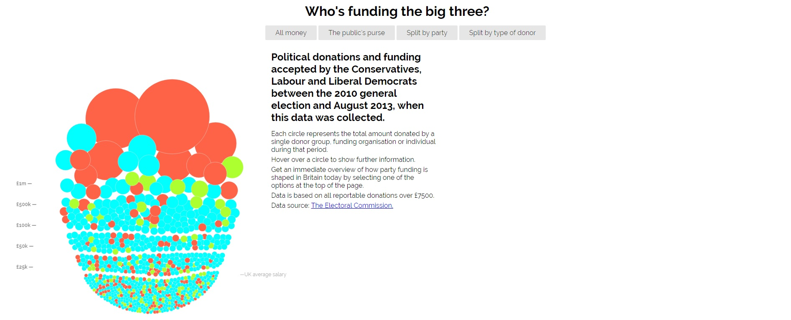
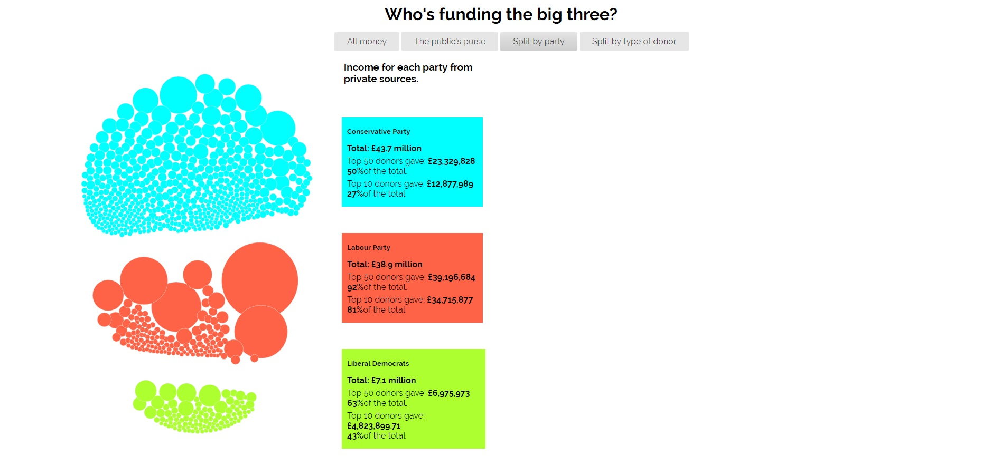
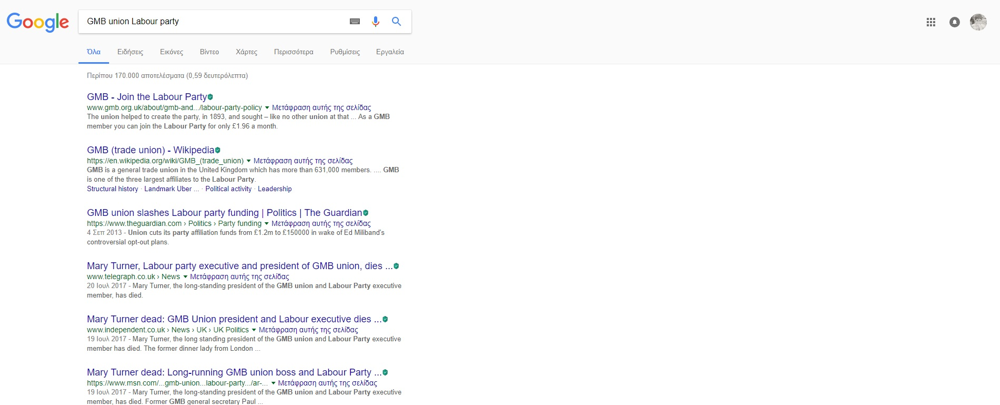

# ΙΟΝΙΟ ΠΑΝΕΠΙΣΤΗΜΙΟ 

# ΤΜΗΜΑ ΠΛΗΡΟΦΟΡΙΚΗΣ 

# ΜΑΘΗΜΑ
## Πολυμέσα
 
Επιβλέπων καθηγητής: Χωριανόπουλος Κωνσταντίνος 

# Επιλογή Εργασίας
## Οπτικοποίηση δεδομένων χορηγιών (UK)

Αχιλλέας Καπετάνιος
ΑΜ: Π2015201

## Παραδοτέο 1
### Σύνδεσμοι Αποθετηρίων

Μαθήματος: https://github.com/achkap/mm

Drafts Branch: https://github.com/achkap/mm/tree/drafts

Εφαρμογής: https://github.com/achkap/D3js-uk-political-donations

Develop Branch: https://github.com/achkap/D3js-uk-political-donations/tree/develop

Σύνδεσμος Εφαρμογής: https://achkap.github.io/D3js-uk-political-donations/

## Παραδοτέο 2

Όλες οι αλλαγές που έγιναν στον κώδικα έχουν σημειωθεί στα αντίστοιχα αρχεία ως σχόλια στον κώδικα. 

Αλλαγή χρωμάτων στις μπάλες με τα δεδομένα:

https://github.com/achkap/D3js-uk-political-donations/blob/gh-pages/chart.js

Αλλαγή χρώματος στα στα 3 πεδία των κομμάτων της ομαδοποίησης Split by party:

https://github.com/achkap/D3js-uk-political-donations/blob/gh-pages/style.css

Προσθήκη ήχου κάθε φορά που ο χρήστης της εφαρμογής κάνει κλικ σε μία από τις επιλογές/κουμπιά ομαδοποίησης των δεδομένων:

https://github.com/achkap/D3js-uk-political-donations/blob/gh-pages/index.html

Ανέβασμα ήχου στο Github

https://github.com/achkap/D3js-uk-political-donations/blob/gh-pages/moneysound.mp3

Άνοιγμα νέου παραθύρου με τα αποτελέσματα της αναζήτησης στο Google για τον αντίστοιχο δωρητή, όταν ο χρήστης κάνει κλικ
σε μία από τις μπάλες. Για καλύτερα αποτελέσματα της αναζήτησης, προστέθηκαν η ιδιότητα (άτομο, εταιρεία, σωματείο κλπ) 
καθώς και το κόμμα στο οποίο έκαναν τη δωρεά.

https://github.com/achkap/D3js-uk-political-donations/blob/gh-pages/chart.js

## Παραδοτέο 3

Όλες οι αλλαγές που έγιναν στον κώδικα έχουν σημειωθεί στα αντίστοιχα αρχεία ως σχόλια στον κώδικα. 

Ο κώδικας τροποποιήθηκε προκειμένου τα γράμματα να μεγενθύνονται κατά 300% κάθε φορά που το ποντίκι περνάει από πάνω. Για να γίνει αυτό τροποποιήθηκε το αρχείο

https://github.com/achkap/D3js-uk-political-donations/blob/gh-pages/style.css

Δυστυχώς ενώ έγινε η προσπάθεια να λειτουργεί το ποντίκι ακριβώς σαν ένας μεγενθυντικός φακός και να μεγαλώνει κάθε γράμμα ξεχωριστά ή κάθε κομμάτι της σελίδας ξεχωριστά από όπου περνάει, αυτό δεν κατέστη δυνατό. Θα μπορούσε να γίνει για εικόνα αλλά όχι για κείμενο.

Επίσης προστέθηκε text2speech για τους κύκλους των δωρητών, έτσι ώστε μόλις το ποντίκι βρίσκεται μέσα σε έναν από τους κύκλους ακούγεται το όνομα του δωρητή, το κόμμα στο οποίο δώρισε τα χρήματα καθώς και το συνολικό ποσό.
Για να γίνει αυτό χρησιμοποιήθηκε το Web Speech API (https://developer.mozilla.org/en-US/docs/Web/API/Web_Speech_API). Στις ήδη υπάρχουσες συναρτήσεις mouseover και mouseout προστέθηκαν η μεταβλητή για το SpeechSynthesis, καθώς και το υψος και ταχύτητα της φωνής, όπως και η εντολή για έναρξη και σταμάτημα της ομιλίας στις συναρτήσεις mouseover και mouseout αντιστοιχα. Δηλαδή να αρχίζει η ομιλία όταν το ποντίκι μπαίνει στον κύκλο και να σταματάει μόλις βγει από αυτόν. Το αρχείο που τροποποιήθηκε είναι το 

https://github.com/achkap/D3js-uk-political-donations/blob/gh-pages/chart.js

