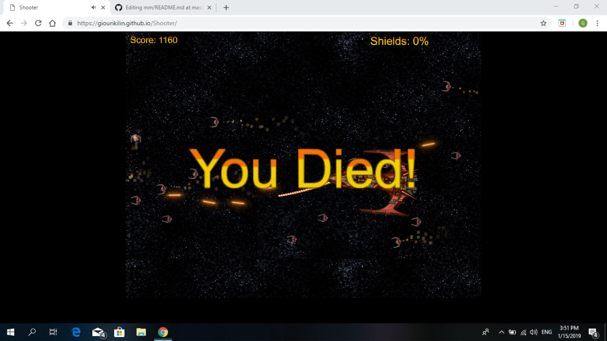
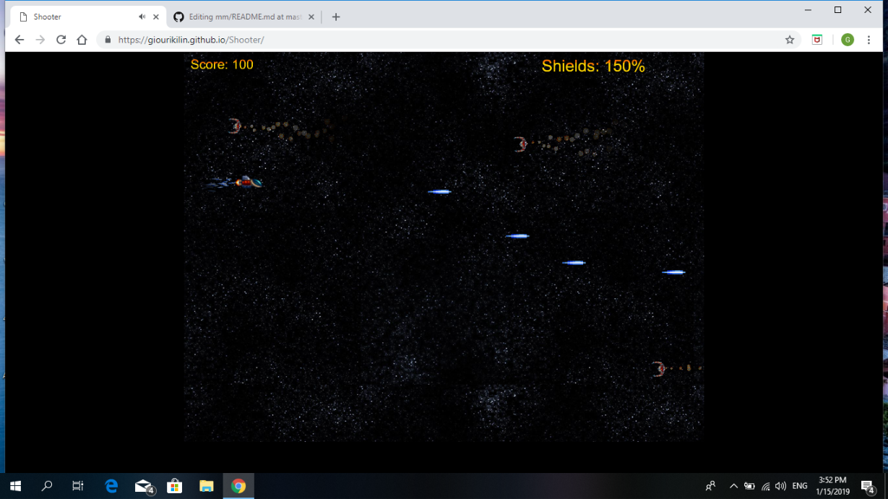
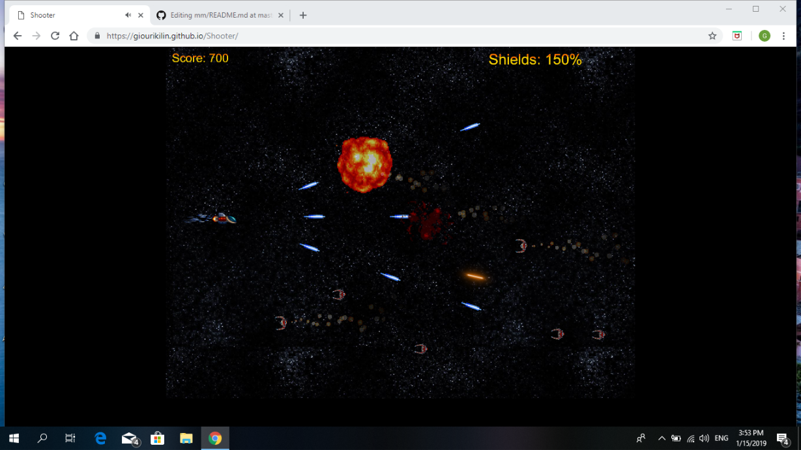

ΜΑΘΗΜΑ Πολυμέσα

Όνομα: Κιλινκαριδης Γιούρι

ΑΜ:Π2016130

Επιβλέπων Καθηγητής: Χωριανόπουλος Κωνσταντίνος

Εργασεία Ανάπτυξης

Forked ΜΜ Repository: https://github.com/giourikilin/mm

Forked Shooter Repository: https://github.com/giourikilin/Shooter

Shooter Game: https://giourikilin.github.io/Shooter/

Παραδοτέο 1:

- [x]  Initial settings (όπως περιγράφονται στο README.md του repository).
- [x]  Link του παιχνιδιού στην αναφορά.
- [x]  Πρόσθεσε ήχους (shooting, explosions, κτλ.) και μουσική.
- [x]  Επέκτεινε το παιχνίδι ώστε να προσθέσεις ζωή και score ακολουθώντας τα steps 18-20 από τις οδηγίες.
- [x]  Ακολούθησε το step 21 από τις οδηγίες. Προσοχή: πρέπει να δημιουργήσεις από εδώ και να χρησιμοποιήσεις το δικό σου font.
       
- [x]  Πρόσθεσε τη δεύτερη κατηγορία εχθρών σύμφωνα με τα steps 22-24 από τις οδηγίες. Για τη συγκεκριμένη κατηγορία 
       εχθρών χρησιμοποίησε την εικόνα enemy3.png αντί για την εικόνα blue-enemy.png. Προσοχή: πρέπει να μελετήσετε 
       τον κώδικα και να τον τροποποιήσετε κατάλληλα ώστε η συμπεριφορά των εχθρών να είναι ίδια αλλά να έρχονται 
       από τα δεξιά προς τα αριστερά της οθόνης και όχι από πάνω προς τα κάτω όπως περιγράφετε στις οδηγίες.
       
- [x]  Πρόσθεσε την πρώτη κατηγορία εχθρών σύμφωνα με τα steps 12-17 από τις οδηγίες. Για την συγκεκριμένη κατηγορία 
       εχθρών χρησιμοποίησε την εικόνα enemy2.png αντί για την εικόνα green-enemy.png. Προσοχή: πρέπει να μελετήσετε 
       τον κώδικα και να τον τροποποιήσετε κατάλληλα ώστε η συμπεριφορά των εχθρών να είναι ίδια αλλά να έρχονται 
       από τα δεξιά προς τα αριστερά της οθόνης και όχι από πάνω προς τα κάτω όπως περιγράφετε στις οδηγίες.

Παραδοτέο 2:

Παραδοτέο 2:

2o Παραδοτέο

Πηγές
- [x] Επεκτείνετε το παιχνίδι ώστε να αναβαθμίζονται τα όπλα του παίχτη σύμφωνα με τα steps 25-26 από τις οδηγίες.

[] Προσθήκη Μenu στην αρχή για επιλογή πίστας και start of level. Δημιουργία τουλάχιστον δυο συνεχόμενων levels. Όταν ο πρωταγωνιστής ολοκληρώνει με επιτυχία το πρώτο level το παιχνίδι να συνεχίζει στο επόμενο. Το δεύτερο level θα πρέπει να είναι δυσκολότερο και να χρησιμοποιήσετε διαφορετικούς εχθρούς (new enemies, asteroids κτλ.). Μπορείτε να μελετήσετε τον κώδικα μιας περσινής εξαιρετικής εργασίας για να πάρετε μια ιδέα πως μπορείτε να υλοποιήσετε το συγκεκριμένο ζητούμενο.

- [x] Προσθήκη ενός μεγάλου εχθρού στο τέλος του level. Μια ιδέα μπορείτε να πάρετε από εδώ. Είστε ελεύθεροι να επιλέξετε την εικόνα και τη συμπεριφορά του μεγάλου εχθρού.

- [x] Τελική αναφορά την εργασίας που θα πρέπει απαραίτητα να περιλαμβάνει link του παιχνιδιού.

Images:

Συμπεράσματα:

Η εργασία ήταν απαιτητική με αρκετά σημεία τα οποία προϋπέθεταν εκτενής αναζήτηση στο διαδίκτυο για την επιτυχή ολοκλήρωση των αναγκαίων ζητουμένων. Η διαδικασία αυτή με βοήθησε να εξελίξω τις γνώσεις μου πάνω στη γλώσσα JS και της βιβλιοθήκης Phaser που μπορεί να χρειαστούν σε μελλοντικές εργασίες.

Εργασια Περιεχομένου

Παραδοτέο 1:

Social Media Link: https://twitter.com/p16kili

Forked Book Repository: https://github.com/giourikilin/gr

Book: https://giourikilin.github.io/gr/

2o Παραδοτέο

links of  posts :
1) https://twitter.com/p16kili/status/1066313984767332352
2) https://twitter.com/p16kili/status/1065996940004024320
3) https://twitter.com/p16kili/status/1065990566087933953
4) https://twitter.com/p16kili/status/1065653119781126144
5) https://twitter.com/p16kili/status/1065648345581043712
6) https://twitter.com/p16kili/status/1064868701701312512
7) https://twitter.com/p16kili/status/1064859856807608320
8) https://twitter.com/p16kili/status/1054357536911081474
9) https://twitter.com/p16kili/status/1053721132661129216
10) https://twitter.com/p16kili/status/1052582234945802240
