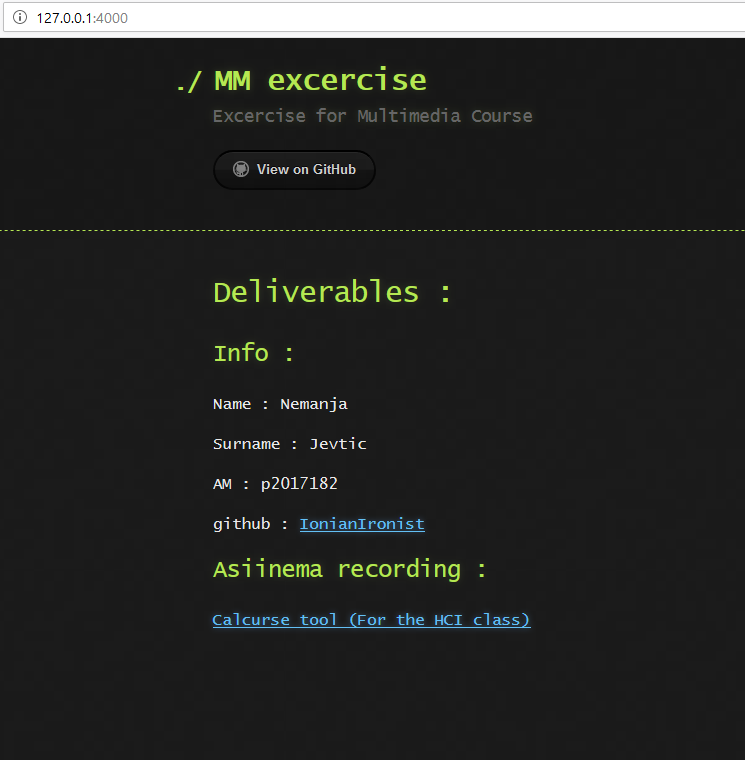
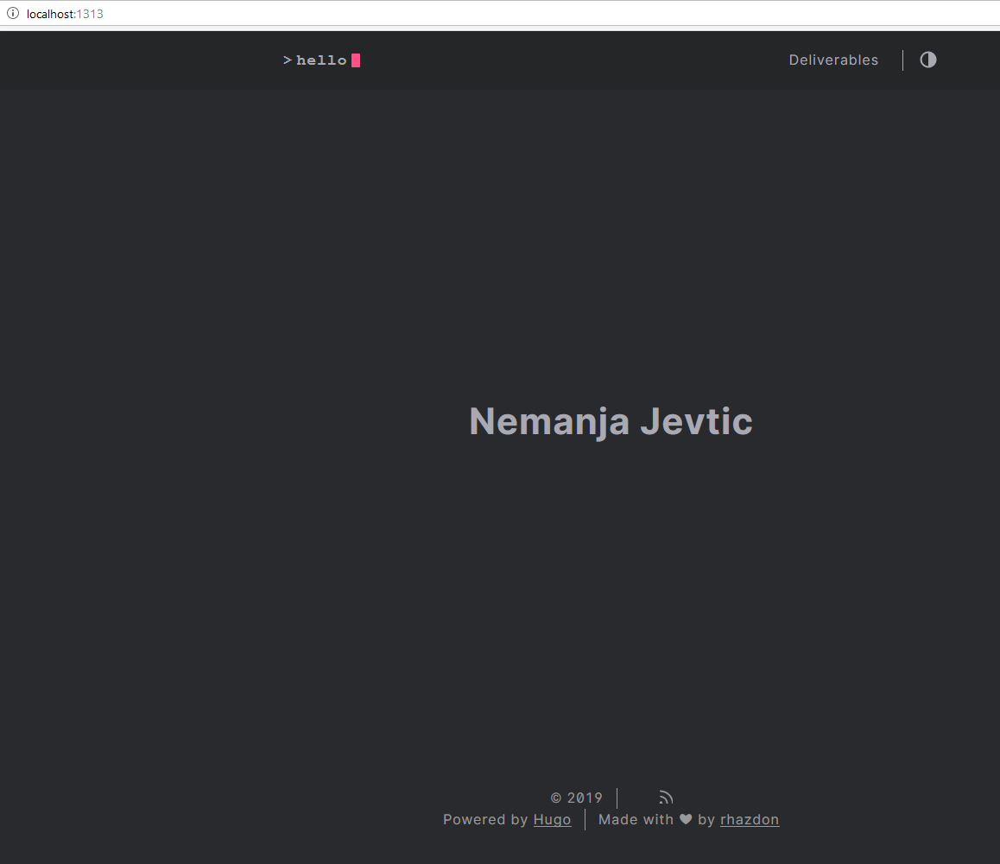
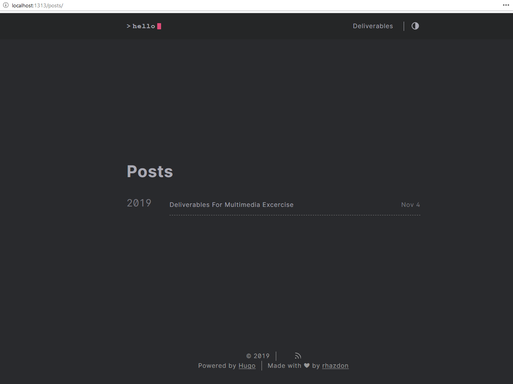
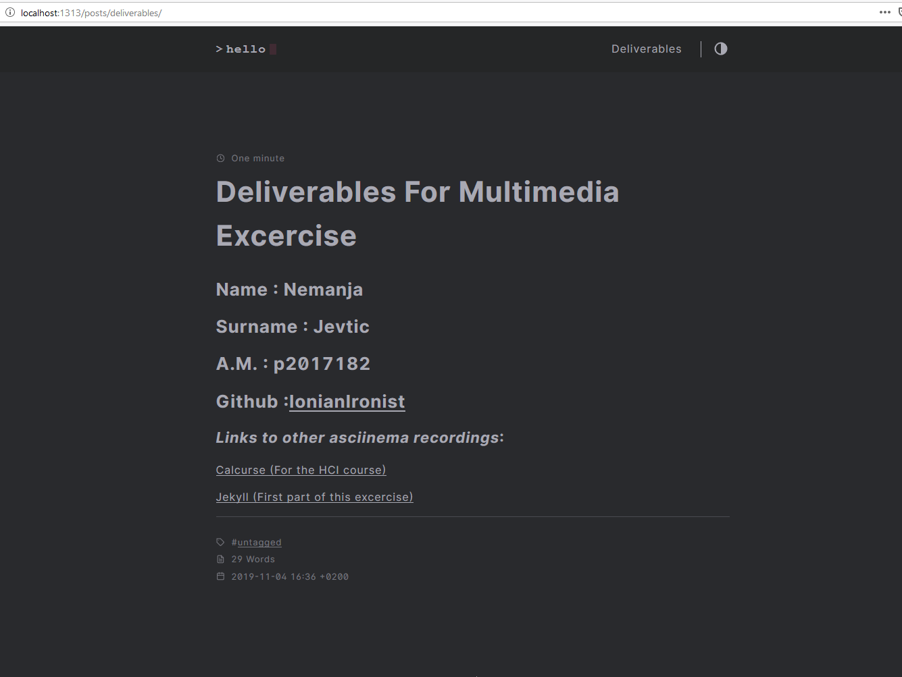

# Ιόνιο Πανεπιστήμιο Τμήμα Πληροφορικής 
## Μάθημα
### Πολυμέσα

## Στοιχεία φοιτητή 

### Νέμανια Γιέβτιτς 
### ΑΜ : π2017182

### 4/Νοε/2019

### Άσκηση : single page with name-AM-github and links to your asciinema deliverables

### Deliverable recording :

[jekyll](https://asciinema.org/a/278630)

### *Τι έχω κάνει* : 

+ Δημηούργησα την βασική σελίδα με την εντολή jekyll new
+ Έχω αφερέσει όλα τα περιττά στοιχεία από την ιστοσελίδα
+ Άλλαξα το θέμα (την εμφάνηση)
+ Πρόσθεσα μιά σύντομη περιγραφή και τίτλο
+ Πρόσθεσα τα deliverables - στοιχεία, ΑΜ, λίνκ προς ασκίνεμα.

### Άσκηση : single page with name-AM-github and links to your asciinema deliverables (Μέρος 2ο)

### Deliverable recording :

[hugo](https://asciinema.org/a/279086)

## *Δείχνω την διαδικασία εκτέλεσης των περίπου ίδιων πραγμάτων με το jekyll αυτην την φορά στο framework hugo*

+ Πρόσθεσα ένα απλό θέμα
+ Αλλαξα τίτλο
+ Προσθεσα menu για posts
+ Ανέβασα το πόστ με τα ζητούμενα

Και στις δυο ιστοσελίδες τα λίνκ προς τα ασκίνεμα και γκίτχαμπ λειτουργούν κανονικά.
Εάν χρειάζεται μπορεί να δημηουργηθει καινούριο repo με τον κώδικα και για τις δυο ιστοσελιδες.

